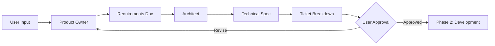
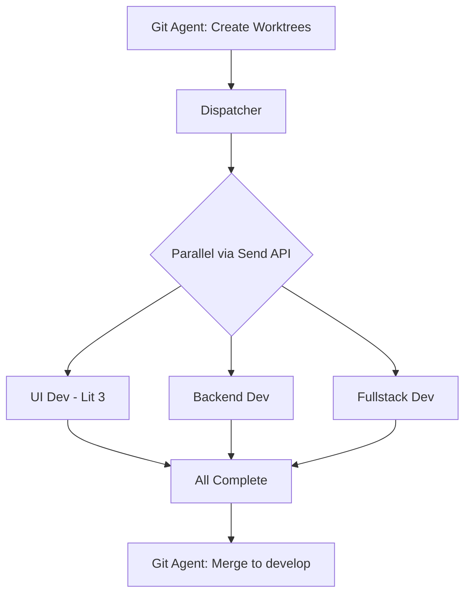
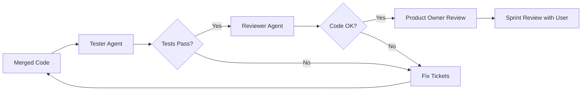
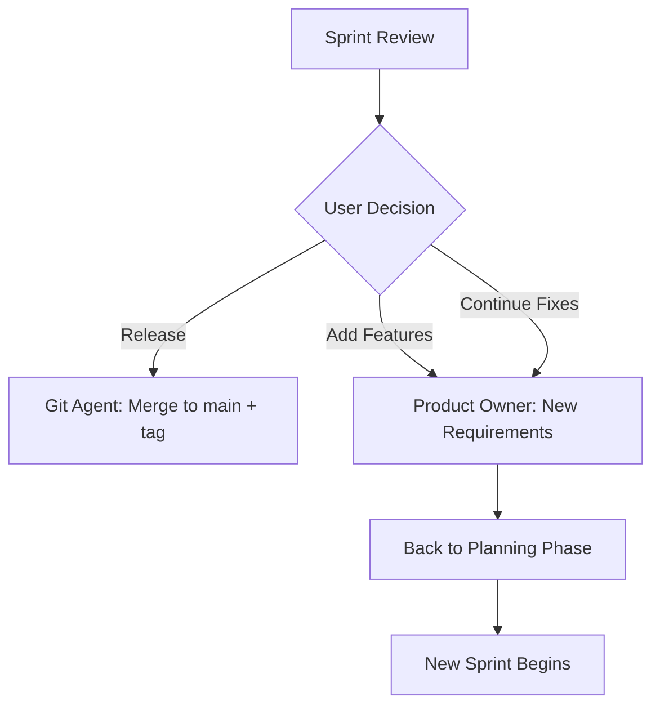

# LangGraph Scrum Team

> A comprehensive AI-powered development team that follows Scrum methodology to build TypeScript applications. Multiple **LangGraph agents** work in parallel, each in its own **tmux pane** and **Git worktree**, coordinated by a **Git Agent** that manages branches and merges.

## Key Architecture: LangGraph + Web Dashboard + tmux

```
┌─────────────────────────────────────────────────────────────────────────────┐
│                    LANGGRAPH + WEB DASHBOARD + TMUX                         │
├─────────────────────────────────────────────────────────────────────────────┤
│                                                                              │
│  BROWSER: http://localhost:3000                                             │
│  ┌─────────────────────────────────────────────────────────────────────┐   │
│  │  🌐 WEB DASHBOARD (Lit 3 + Vite)                                    │   │
│  │  [📋 Kanban] [🤖 Agents] [⚙️ Config] [🔀 Git] [🖥️ Terminal]        │   │
│  │                                                                      │   │
│  │  • Configure team & LLMs        • Live terminal view (xterm.js)    │   │
│  │  • Start/approve sprints        • Real-time agent status           │   │
│  │  • Add/remove agents            • Git branch visualization         │   │
│  └─────────────────────────────────────────────────────────────────────┘   │
│                          │ WebSocket (ws://localhost:8765)                  │
│                          ▼                                                  │
│  LANGGRAPH SERVER (FastAPI + WebSocket)                                    │
│  ┌─────────────────────────────────────────────────────────────────────┐   │
│  │  • Serves dashboard + WebSocket API                                 │   │
│  │  • LangGraph orchestration with Send()                              │   │
│  │  • Direct LLM API calls (Claude, GPT-4)                             │   │
│  │  • Streams tmux output to browser                                   │   │
│  └─────────────────────────────────────────────────────────────────────┘   │
│                          │ Spawns processes                                 │
│                          ▼                                                  │
│  TMUX SESSION: scrum-agents (viewable in browser OR terminal)             │
│  ┌─────────────────────────────────────────────────────────────────────┐   │
│  │ ┌─────────┐ ┌─────────┐ ┌─────────┐ ┌─────────┐ ┌─────────┐ ┌─────┐│   │
│  │ │ product │ │architect│ │git-agent│ │ ui-dev  │ │ backend │ │test ││   │
│  │ │ -owner  │ │         │ │ merge   │ │ Lit 3   │ │  API    │ │     ││   │
│  │ └─────────┘ └─────────┘ └─────────┘ └─────────┘ └─────────┘ └─────┘│   │
│  └─────────────────────────────────────────────────────────────────────┘   │
│                                                                              │
│  GIT WORKTREES (Isolated Development)                                       │
│  ┌─────────────────────────────────────────────────────────────────────┐   │
│  │  .worktrees/ticket-1/  →  feature/ticket-1 branch                   │   │
│  │  .worktrees/ticket-2/  →  feature/ticket-2 branch                   │   │
│  │  .worktrees/ticket-3/  →  feature/ticket-3 branch                   │   │
│  └─────────────────────────────────────────────────────────────────────┘   │
│                                                                              │
└─────────────────────────────────────────────────────────────────────────────┘
```

**Key features**:
- **LangGraph** orchestrates agents with direct LLM API access
- **Web Dashboard** (Lit 3 + Vite) - open `http://localhost:3000` in browser
- **All agents in tmux**: Product Owner, Architect, Git Agent, Devs, Tester, Reviewer
- **Live terminal in browser** via xterm.js - watch agents work!
- **Iterative sprint cycle**: Planning → Development → Review → Loop or Release
- **Parallel dev execution** via LangGraph's `Send()` API
- **Git Agent** coordinates branches, merges, and releases
- **Git Worktrees** give each dev agent an isolated workspace

## Table of Contents

1. [Overview](#overview)
2. [Architecture](#architecture)
3. [Components](#components)
4. [Agents](#agents)
5. [Git Agent](#git-agent)
6. [tmux Integration](#tmux-integration)
7. [Knowledge Layer](#knowledge-layer)
8. [Web Dashboard](#web-dashboard)
9. [Workflow](#workflow)
10. [Configuration](#configuration)
11. [Getting Started](#getting-started)

---

## Overview

This project implements a **Scrum Development Team** using LangGraph for orchestration. Multiple AI agents work in parallel, each in its own **tmux pane** and **Git worktree**, coordinated by a **Git Agent** that manages branches and merges.

### Key Features

| Feature | Description |
|---------|-------------|
| **Parallel Agents** | Multiple agents work simultaneously via LangGraph's `Send()` API |
| **tmux Terminals** | Each agent runs in its own tmux pane (attach/detach anytime) |
| **Git Agent** | Dedicated agent for branch creation, merging, and releases |
| **Git Worktrees** | Isolated workspace per ticket (no branch switching) |
| **Direct LLM Access** | LangGraph agents call Claude/GPT APIs directly |
| **Persistent Memory** | SQLite + ChromaDB for decisions, lessons, patterns |
| **Web Dashboard** | Lit 3 + Vite browser UI with live terminal view |

### System Requirements

- Python 3.11+
- tmux (terminal multiplexer)
- Node.js 18+ (for TypeScript projects and dashboard)
- Git 2.30+ with worktree support
- LLM API keys (Claude/OpenAI)
- Modern browser (Chrome, Firefox, Safari)

---

## Architecture

### High-Level Architecture

```
┌─────────────────────────────────────────────────────────────────────────────┐
│                              USER LAYER                                      │
├─────────────────────────────────────────────────────────────────────────────┤
│  ┌──────────────────────┐              ┌──────────────────────┐             │
│  │   Web Dashboard      │              │   TMUX SESSION       │             │
│  │   localhost:3000     │              │   scrum-agents       │             │
│  └──────────┬───────────┘              └──────────────────────┘             │
│             │ WebSocket                           ▲ Spawns panes            │
└─────────────┼─────────────────────────────────────┼─────────────────────────┘
              │                                     │
┌─────────────┼─────────────────────────────────────┼─────────────────────────┐
│             ▼                                     │                         │
│  ┌────────────────────────────────────────────────┴───────────────────────┐ │
│  │                     LANGGRAPH SERVER                                   │ │
│  ├────────────────────────────────────────────────────────────────────────┤ │
│  │  ┌─────────────┐  ┌─────────────┐  ┌─────────────┐  ┌─────────────┐   │ │
│  │  │   State     │  │   Ticket    │  │  Knowledge  │  │    Tmux     │   │ │
│  │  │  Manager    │  │ Dispatcher  │  │    Layer    │  │   Manager   │   │ │
│  │  └─────────────┘  └─────────────┘  └─────────────┘  └─────────────┘   │ │
│  ├────────────────────────────────────────────────────────────────────────┤ │
│  │                PARALLEL AGENTS (via Send() API)                        │ │
│  │  ┌─────────┐ ┌─────────┐ ┌─────────┐ ┌─────────┐ ┌─────────┐         │ │
│  │  │Product  │ │Architect│ │UI Dev   │ │Backend  │ │Reviewer │         │ │
│  │  │Owner    │ │         │ │Agent    │ │Agent    │ │Agent    │         │ │
│  │  └─────────┘ └─────────┘ └─────────┘ └─────────┘ └─────────┘         │ │
│  │  ┌─────────┐                                     ┌─────────┐         │ │
│  │  │ Tester  │                                     │Git Agent│         │ │
│  │  │ Agent   │                                     └─────────┘         │ │
│  │  └─────────┘                                                          │ │
│  └────────────────────────────────────────────────────────────────────────┘ │
│                                    │                                        │
│                     ORCHESTRATION LAYER                                     │
└────────────────────────────────────┼────────────────────────────────────────┘
                                     │
┌────────────────────────────────────┼────────────────────────────────────────┐
│                                    ▼                                        │
│  ┌─────────────┐  ┌─────────────┐  ┌─────────────┐  ┌─────────────┐        │
│  │  LLM API    │  │  File       │  │  Git        │  │  Playwright │        │
│  │ Claude/GPT  │  │  System     │  │  Repository │  │  (Browser)  │        │
│  └─────────────┘  └─────────────┘  └─────────────┘  └─────────────┘        │
│                           EXTERNAL SERVICES                                 │
└─────────────────────────────────────────────────────────────────────────────┘
```

### Component Communication

| From | To | Protocol | Purpose |
|------|-----|----------|---------|
| Dashboard | LangGraph Server | WebSocket | Commands, status updates |
| LangGraph | LLM API | HTTP/REST | Agent reasoning (Claude/GPT) |
| LangGraph | tmux | Subprocess | Agent terminal panes |
| LangGraph | File System | Direct | Code generation |
| LangGraph | Git | Subprocess | Version control, worktrees |
| LangGraph | Playwright | Direct | Browser testing for UI |

---

## Components

### 1. State Manager

Manages the global state of the Scrum project.

```python
from typing import TypedDict, Literal
from dataclasses import dataclass, field

class Ticket(TypedDict):
    id: str
    title: str
    description: str
    type: Literal["feature", "bug", "chore"]
    status: Literal["draft", "approved", "in_progress", "review", "testing", "done", "rejected"]
    assigned_to: str | None
    branch: str | None
    files_changed: list[str]
    created_at: str
    updated_at: str

class ScrumState(TypedDict):
    # Project info
    project_name: str
    project_path: str
    
    # Phase management
    phase: Literal["planning", "development", "review", "complete"]
    
    # Planning artifacts
    requirements: str
    technical_spec: str
    plan_approved: bool
    
    # Ticket management
    tickets: list[Ticket]
    active_tickets: dict[str, Ticket]  # agent_id -> ticket
    completed_tickets: list[Ticket]
    
    # Agent status
    agents: dict[str, AgentStatus]
    
    # Git state
    branches: list[str]
    pending_merges: list[str]
    conflicts: list[ConflictInfo]
    
    # Memory references
    memory_context: list[str]
    applied_conventions: list[str]
```

### 2. Ticket Dispatcher

Assigns tickets to available agents using LangGraph's `Send()` API for parallel execution.

```python
from langgraph.constants import Send

def dispatch_tickets(state: ScrumState) -> list[Send]:
    """Dispatch tickets to available agents in parallel."""
    sends = []
    available_agents = get_available_agents(state)
    pending_tickets = get_pending_tickets(state)
    
    for agent, ticket in zip(available_agents, pending_tickets):
        sends.append(Send(
            node=agent.node_name,
            state={"ticket": ticket, "context": get_context(ticket)}
        ))
    
    return sends
```

### 3. Knowledge Layer

Provides memory, conventions, and code examples to agents.

```python
class KnowledgeLayer:
    def __init__(self, project_path: str):
        self.memory = MemoryStore(project_path / ".langgraph/memory")
        self.conventions = ConventionStore(project_path / ".langgraph/conventions")
        self.examples = ExampleStore(project_path / ".langgraph/examples")
        self.trajectory = TrajectoryStore(project_path / ".langgraph/trajectory")
    
    def get_context_for_task(self, task: str) -> KnowledgeContext:
        """Retrieve relevant context for a task."""
        return KnowledgeContext(
            relevant_decisions=self.memory.search_decisions(task),
            lessons_learned=self.memory.search_lessons(task),
            applicable_conventions=self.conventions.get_applicable(task),
            code_examples=self.examples.search(task),
            trajectory_notes=self.trajectory.get_current_priorities()
        )
    
    def record_decision(self, decision: Decision) -> None:
        """Store a decision in long-term memory."""
        self.memory.store_decision(decision)
    
    def record_lesson(self, lesson: Lesson) -> None:
        """Store a lesson learned."""
        self.memory.store_lesson(lesson)
```

### 4. Tool Executor

Executes file operations, terminal commands, and external tool calls.

```python
class ToolExecutor:
    async def write_file(self, path: str, content: str) -> Result:
        """Write content to a file."""
        
    async def read_file(self, path: str) -> str:
        """Read file contents."""
        
    async def run_command(self, command: str, cwd: str) -> CommandResult:
        """Run a terminal command."""
        
    async def run_tests(self, test_path: str) -> TestResult:
        """Run tests and return results."""
        
    async def lint_code(self, file_path: str) -> LintResult:
        """Run linter on code."""
        
    async def call_browser(self, action: str, args: dict) -> Any:
        """Call Playwright for browser testing."""
```

---

## Agents

### Agent Overview

| Agent | Role | Phase | Capabilities |
|-------|------|-------|--------------|
| **Product Owner** | Requirements analysis | Planning | Creates user stories, defines acceptance criteria |
| **Architect** | Technical design | Planning | Designs architecture, creates ticket breakdown |
| **UI Developer** | Frontend development | Development | Lit 3 web components, styling, browser testing |
| **Backend Developer** | API development | Development | API routes, database, services |
| **Fullstack Developer** | Integration work | Development | Connects frontend to backend |
| **Reviewer** | Code review | Review | Reviews code quality, suggests improvements |
| **Tester** | Testing | Testing | Writes and runs tests |
| **Git Agent** | Version control | All | Branch management, merging, conflict resolution |

### Agent Structure

Each agent follows a common structure:

```python
class BaseAgent:
    def __init__(self, agent_id: str, knowledge: KnowledgeLayer):
        self.id = agent_id
        self.knowledge = knowledge
        self.tools = ToolExecutor()
    
    async def execute(self, state: AgentState) -> AgentState:
        # 1. Get context from knowledge layer
        context = self.knowledge.get_context_for_task(state.task)
        
        # 2. Build prompt with context
        prompt = self.build_prompt(state.task, context)
        
        # 3. Call LLM
        response = await self.call_llm(prompt)
        
        # 4. Validate response against conventions
        validation = self.validate(response, context.conventions)
        
        if not validation.passed:
            # Retry with feedback
            return await self.retry_with_feedback(state, validation.errors)
        
        # 5. Execute actions
        result = await self.execute_actions(response.actions)
        
        # 6. Update memory
        self.knowledge.record_lesson(self.extract_lessons(result))
        
        return state.update(result=result)
```

### LangGraph Agent Architecture

In this architecture, **LangGraph agents ARE the workers**. Each agent:
- Has direct LLM API access (Claude, GPT-4, etc.)
- Runs in its own tmux pane for real-time monitoring
- Works in an assigned Git worktree
- Is dispatched in parallel via LangGraph's `Send()` API

```yaml
# .langgraph/config/agents.yaml
# Configuration for agent roles and LLM settings
agent_roles:
  product_owner:
    description: "Requirements analysis and user stories"
    phase: planning
    llm: claude-3-5-sonnet
    system_prompt: |
      You are a Product Owner. Analyze requirements and create user stories.
  
  architect:
    description: "System design and technical decisions"  
    phase: planning
    llm: claude-3-5-sonnet
    system_prompt: |
      You are a Software Architect. Design systems and break down into tickets.
  
  ui_developer:
    description: "Frontend development with browser testing"
    phase: development
    llm: gpt-4o
    tools:
      - playwright  # For visual testing
    system_prompt: |
      You are a UI Developer. Build Lit 3 web components.
      Test visually using Playwright.
  
  backend_developer:
    description: "API and business logic development"
    phase: development
    llm: claude-3-5-sonnet
    system_prompt: |
      You are a Backend Developer. Build APIs and services.
  
  reviewer:
    description: "Code review and quality checks"
    phase: review
    llm: claude-3-5-sonnet
    system_prompt: |
      You are a Code Reviewer. Check code quality and conventions.
  
  tester:
    description: "Test creation and execution"
    phase: testing
    llm: claude-3-5-sonnet
    system_prompt: |
      You are a Tester. Write and run tests for the code.
```

### Agent Spawning

Agents are spawned by LangGraph with their own tmux pane and worktree:

```python
async def spawn_agent(
    ticket_id: str,
    role: str,
    tmux: TmuxManager,
    git_agent: GitAgent
) -> Agent:
    """
    Spawn an agent with its own tmux pane and worktree.
    """
    # Git Agent creates the worktree
    worktree_path = await git_agent.create_branch_for_ticket(ticket_id)
    
    # Get role configuration
    role_config = config["agent_roles"][role]
    
    # Create LLM client for this agent
    llm = create_llm_client(role_config.get("llm", "claude-3-5-sonnet"))
    
    # Create agent
    agent = Agent(
        agent_id=f"{role}-{ticket_id}",
        role=role,
        llm_client=llm,
        tmux=tmux
    )
    
    # Set up tmux pane
    await agent.setup(worktree_path)
    
    return agent
```

### Agent Execution

Agents execute their work in their own tmux pane:

```python
async def agent_work_node(state: WorkflowState) -> WorkflowState:
    """
    LangGraph node for agent work.
    Invoked via Send() for parallel execution.
    """
    agent = state.agent
    ticket = state.ticket
    
    # Get context from knowledge layer
    context = knowledge.get_context_for_task(ticket.description)
    
    # Build prompt with role and context
    prompt = f"""
    {agent.role_config["system_prompt"]}
    
    TASK: {ticket.title}
    {ticket.description}
    
    CONTEXT:
    - Conventions: {context.conventions}
    - Examples: {context.examples}
    - Past decisions: {context.decisions}
    """
    
    # Agent works with LLM
    response = await agent.llm.generate(prompt)
    
    # Execute actions and log to tmux
    await agent.execute_actions(response.actions)
    
    return state.update(result=response)
```

### UI Developer Agent (Detailed)

The UI Developer has special capabilities for browser testing using Playwright:

```python
class UIDeveloperAgent(BaseAgent):
    def __init__(self, *args, **kwargs):
        super().__init__(*args, **kwargs)
        self.browser = None  # Playwright browser
    
    async def execute(self, state: AgentState) -> AgentState:
        # Standard development flow
        context = self.knowledge.get_context_for_task(state.task)
        code = await self.generate_code(state.task, context)
        
        # Write code to files
        await self.tools.write_file(state.file_path, code)
        
        # Start dev server if not running
        await self.tmux.send_command(self.agent_id, "npm run dev")
        
        # Browser testing via Playwright
        await self.browser.goto("http://localhost:3000")
        await self.browser.wait_for_selector(state.component_selector)
        
        # Take screenshot for validation
        screenshot = await self.browser.screenshot()
        
        # Validate visually (LLM vision)
        validation = await self.validate_screenshot(screenshot, state.expected_appearance)
        
        if not validation.passed:
            # Fix visual issues
            return await self.fix_visual_issues(state, validation.feedback)
        
        return state.update(status="complete", screenshot=screenshot)
```

---

## Knowledge Layer

### Memory Architecture

The memory system uses a **hybrid storage approach** optimized for different query patterns:

#### Storage Layers

```
┌─────────────────────────────────────────────────────────────────────────┐
│                         MEMORY ARCHITECTURE                              │
├─────────────────────────────────────────────────────────────────────────┤
│                                                                          │
│  ┌────────────────────────┐         ┌────────────────────────────┐     │
│  │      SQLite DB         │  sync   │     ChromaDB (Vector)      │     │
│  │   (Structured Data)    │ ──────► │    (Semantic Search)       │     │
│  ├────────────────────────┤         ├────────────────────────────┤     │
│  │ • decisions            │         │ • decision_embeddings      │     │
│  │ • lessons_learned      │         │ • lesson_embeddings        │     │
│  │ • conversations        │         │ • code_pattern_embeddings  │     │
│  │ • ticket_history       │         │ • codebase_index           │     │
│  │ • agent_actions        │         │ • conversation_summaries   │     │
│  └────────────────────────┘         └────────────────────────────┘     │
│            │                                    │                       │
│            ▼                                    ▼                       │
│  ┌────────────────────────┐         ┌────────────────────────────┐     │
│  │    Exact Queries       │         │    Semantic Queries        │     │
│  │                        │         │                            │     │
│  │ • Get decision by ID   │         │ • "How do we handle auth?" │     │
│  │ • Filter by date/type  │         │ • "Find similar patterns"  │     │
│  │ • List recent lessons  │         │ • "What caused this bug?"  │     │
│  └────────────────────────┘         └────────────────────────────┘     │
│                                                                          │
│  ┌───────────────────────────────────────────────────────────────────┐ │
│  │                    FILE SYSTEM (Git-tracked)                       │ │
│  ├───────────────────────────────────────────────────────────────────┤ │
│  │  .langgraph/                                                      │ │
│  │  ├── conventions/     # YAML - human editable rules              │ │
│  │  ├── examples/        # Code patterns - templates                │ │
│  │  ├── trajectory/      # YAML - roadmap, priorities               │ │
│  │  └── checkpoints/     # Binary - LangGraph state snapshots       │ │
│  └───────────────────────────────────────────────────────────────────┘ │
└─────────────────────────────────────────────────────────────────────────┘
```

#### Why This Hybrid Approach?

| Query Type | Example | Best Storage |
|------------|---------|--------------|
| **Exact lookup** | "Get decision dec-001" | SQLite |
| **Filtered list** | "Lessons from last week" | SQLite |
| **Semantic search** | "How do we handle errors?" | Vector DB |
| **Similar code** | "Find patterns like this" | Vector DB |
| **Human editing** | Update conventions | File System |
| **Version control** | Track changes over time | File System (Git) |

#### Implementation

```python
from dataclasses import dataclass
from datetime import datetime
import sqlite3
import chromadb
from chromadb.config import Settings

@dataclass
class MemoryConfig:
    db_path: str = ".langgraph/memory/memory.db"
    chroma_path: str = ".langgraph/memory/chroma"
    embedding_model: str = "text-embedding-3-small"
    
class MemoryStore:
    def __init__(self, project_path: str, config: MemoryConfig = None):
        self.config = config or MemoryConfig()
        self.project_path = project_path
        
        # SQLite for structured data
        self.db = sqlite3.connect(project_path / self.config.db_path)
        self._init_tables()
        
        # ChromaDB for semantic search
        self.chroma = chromadb.Client(Settings(
            chroma_db_impl="duckdb+parquet",
            persist_directory=str(project_path / self.config.chroma_path)
        ))
        self._init_collections()
    
    def _init_tables(self):
        """Initialize SQLite tables."""
        self.db.executescript("""
            CREATE TABLE IF NOT EXISTS decisions (
                id TEXT PRIMARY KEY,
                date TEXT NOT NULL,
                topic TEXT NOT NULL,
                decision TEXT NOT NULL,
                reason TEXT,
                alternatives_rejected TEXT,  -- JSON array
                related_files TEXT,          -- JSON array
                created_at TEXT DEFAULT CURRENT_TIMESTAMP
            );
            
            CREATE TABLE IF NOT EXISTS lessons (
                id TEXT PRIMARY KEY,
                date TEXT NOT NULL,
                type TEXT NOT NULL,          -- bug_pattern, performance, security, etc.
                description TEXT NOT NULL,
                solution TEXT NOT NULL,
                code_pattern TEXT,
                affected_tickets TEXT,       -- JSON array
                created_at TEXT DEFAULT CURRENT_TIMESTAMP
            );
            
            CREATE TABLE IF NOT EXISTS conversations (
                id TEXT PRIMARY KEY,
                session_id TEXT NOT NULL,
                role TEXT NOT NULL,          -- user, assistant, system
                content TEXT NOT NULL,
                summary TEXT,                -- LLM-generated summary
                created_at TEXT DEFAULT CURRENT_TIMESTAMP
            );
            
            CREATE INDEX IF NOT EXISTS idx_decisions_topic ON decisions(topic);
            CREATE INDEX IF NOT EXISTS idx_decisions_date ON decisions(date);
            CREATE INDEX IF NOT EXISTS idx_lessons_type ON lessons(type);
        """)
    
    def _init_collections(self):
        """Initialize ChromaDB collections."""
        self.decision_collection = self.chroma.get_or_create_collection(
            name="decisions",
            metadata={"description": "Decision history embeddings"}
        )
        self.lesson_collection = self.chroma.get_or_create_collection(
            name="lessons",
            metadata={"description": "Lessons learned embeddings"}
        )
        self.code_collection = self.chroma.get_or_create_collection(
            name="code_patterns",
            metadata={"description": "Code pattern embeddings from codebase"}
        )
    
    # ==================== WRITE OPERATIONS ====================
    
    def store_decision(self, decision: Decision) -> None:
        """Store a decision in both SQLite and Vector DB."""
        # Store in SQLite
        self.db.execute("""
            INSERT INTO decisions (id, date, topic, decision, reason, alternatives_rejected, related_files)
            VALUES (?, ?, ?, ?, ?, ?, ?)
        """, (
            decision.id,
            decision.date,
            decision.topic,
            decision.decision,
            decision.reason,
            json.dumps(decision.alternatives_rejected),
            json.dumps(decision.related_files)
        ))
        self.db.commit()
        
        # Store embedding in ChromaDB
        embedding_text = f"{decision.topic}: {decision.decision}. {decision.reason}"
        self.decision_collection.add(
            ids=[decision.id],
            documents=[embedding_text],
            metadatas=[{"topic": decision.topic, "date": decision.date}]
        )
    
    def store_lesson(self, lesson: Lesson) -> None:
        """Store a lesson in both SQLite and Vector DB."""
        # Store in SQLite
        self.db.execute("""
            INSERT INTO lessons (id, date, type, description, solution, code_pattern, affected_tickets)
            VALUES (?, ?, ?, ?, ?, ?, ?)
        """, (
            lesson.id,
            lesson.date,
            lesson.type,
            lesson.description,
            lesson.solution,
            lesson.code_pattern,
            json.dumps(lesson.affected_tickets)
        ))
        self.db.commit()
        
        # Store embedding in ChromaDB
        embedding_text = f"{lesson.type}: {lesson.description}. Solution: {lesson.solution}"
        self.lesson_collection.add(
            ids=[lesson.id],
            documents=[embedding_text],
            metadatas=[{"type": lesson.type, "date": lesson.date}]
        )
    
    # ==================== READ OPERATIONS ====================
    
    def get_decision(self, decision_id: str) -> Decision | None:
        """Get a specific decision by ID."""
        row = self.db.execute(
            "SELECT * FROM decisions WHERE id = ?", (decision_id,)
        ).fetchone()
        return Decision.from_row(row) if row else None
    
    def search_decisions(self, query: str, limit: int = 5) -> list[Decision]:
        """Semantic search for relevant decisions."""
        results = self.decision_collection.query(
            query_texts=[query],
            n_results=limit
        )
        
        decisions = []
        for decision_id in results['ids'][0]:
            decision = self.get_decision(decision_id)
            if decision:
                decisions.append(decision)
        
        return decisions
    
    def search_lessons(self, query: str, limit: int = 5) -> list[Lesson]:
        """Semantic search for relevant lessons."""
        results = self.lesson_collection.query(
            query_texts=[query],
            n_results=limit
        )
        
        lessons = []
        for lesson_id in results['ids'][0]:
            lesson = self.get_lesson(lesson_id)
            if lesson:
                lessons.append(lesson)
        
        return lessons
    
    def search_code_patterns(self, query: str, limit: int = 5) -> list[CodePattern]:
        """Search for similar code patterns."""
        results = self.code_collection.query(
            query_texts=[query],
            n_results=limit
        )
        
        return [
            CodePattern(
                file_path=meta['file_path'],
                content=doc,
                relevance=1 - dist  # Convert distance to relevance
            )
            for doc, meta, dist in zip(
                results['documents'][0],
                results['metadatas'][0],
                results['distances'][0]
            )
        ]
    
    # ==================== CODEBASE INDEXING ====================
    
    async def index_codebase(self, src_path: str) -> None:
        """Index the codebase for semantic search."""
        from pathlib import Path
        
        for file_path in Path(src_path).rglob("*.ts"):
            content = file_path.read_text()
            
            # Split into logical chunks (functions, classes, etc.)
            chunks = self._split_into_chunks(content)
            
            for i, chunk in enumerate(chunks):
                chunk_id = f"{file_path}:{i}"
                self.code_collection.upsert(
                    ids=[chunk_id],
                    documents=[chunk.content],
                    metadatas=[{
                        "file_path": str(file_path),
                        "chunk_type": chunk.type,  # function, class, etc.
                        "name": chunk.name
                    }]
                )
    
    def _split_into_chunks(self, content: str) -> list[CodeChunk]:
        """Split code into semantic chunks."""
        # Use tree-sitter or simple regex to find functions/classes
        # This is a simplified version
        import re
        
        chunks = []
        
        # Find functions
        function_pattern = r'(export\s+)?(async\s+)?function\s+(\w+)[^{]*\{[^}]*\}'
        for match in re.finditer(function_pattern, content, re.DOTALL):
            chunks.append(CodeChunk(
                type="function",
                name=match.group(3),
                content=match.group(0)
            ))
        
        # Find arrow functions assigned to const
        arrow_pattern = r'(export\s+)?const\s+(\w+)\s*=\s*(async\s+)?\([^)]*\)\s*=>\s*\{[^}]*\}'
        for match in re.finditer(arrow_pattern, content, re.DOTALL):
            chunks.append(CodeChunk(
                type="function",
                name=match.group(2),
                content=match.group(0)
            ))
        
        return chunks
```

#### Context Retrieval for Agents

When an agent receives a task, the memory system provides relevant context:

```python
class KnowledgeRetriever:
    def __init__(self, memory: MemoryStore, conventions: ConventionStore):
        self.memory = memory
        self.conventions = conventions
    
    def get_context_for_task(self, task: str, file_paths: list[str] = None) -> AgentContext:
        """Retrieve all relevant context for a task."""
        
        # 1. Search for relevant decisions
        relevant_decisions = self.memory.search_decisions(task, limit=3)
        
        # 2. Search for relevant lessons
        relevant_lessons = self.memory.search_lessons(task, limit=3)
        
        # 3. Search for similar code patterns
        code_examples = self.memory.search_code_patterns(task, limit=3)
        
        # 4. Get applicable conventions based on file paths
        applicable_conventions = []
        if file_paths:
            for file_path in file_paths:
                conventions = self.conventions.get_for_file(file_path)
                applicable_conventions.extend(conventions)
        
        # 5. Build context object
        return AgentContext(
            decisions=relevant_decisions,
            lessons=relevant_lessons,
            code_examples=code_examples,
            conventions=applicable_conventions,
            prompt_injection=self._build_prompt_injection(
                relevant_decisions, 
                relevant_lessons, 
                code_examples,
                applicable_conventions
            )
        )
    
    def _build_prompt_injection(self, decisions, lessons, examples, conventions) -> str:
        """Build the context string to inject into agent prompts."""
        parts = []
        
        if decisions:
            parts.append("## Relevant Past Decisions")
            for d in decisions:
                parts.append(f"- **{d.topic}**: {d.decision} (Reason: {d.reason})")
        
        if lessons:
            parts.append("\n## Lessons Learned")
            for l in lessons:
                parts.append(f"- **{l.type}**: {l.description} → {l.solution}")
        
        if examples:
            parts.append("\n## Code Examples to Follow")
            for e in examples:
                parts.append(f"```typescript\n// From {e.file_path}\n{e.content}\n```")
        
        if conventions:
            parts.append("\n## Conventions to Follow")
            for c in conventions:
                parts.append(f"- {c.rule}: {c.description}")
        
        return "\n".join(parts)
```

#### Memory Lifecycle

```
┌─────────────────────────────────────────────────────────────────┐
│                     MEMORY LIFECYCLE                             │
├─────────────────────────────────────────────────────────────────┤
│                                                                  │
│  1. TASK RECEIVED                                               │
│     └── Retrieve relevant context from memory                   │
│         • Search decisions: "Have we decided on this before?"  │
│         • Search lessons: "What did we learn about this?"       │
│         • Search code: "How did we implement similar things?"   │
│                                                                  │
│  2. CONTEXT INJECTED                                            │
│     └── Add to agent prompt                                     │
│         "Based on past decisions: use fetch, not axios"        │
│         "Lesson learned: always validate with Zod"              │
│         "Follow this pattern: [code example]"                   │
│                                                                  │
│  3. AGENT EXECUTES                                              │
│     └── Agent works with full context                           │
│                                                                  │
│  4. RESULT VALIDATED                                            │
│     └── Check against conventions                               │
│     └── If rejected: record as lesson                           │
│                                                                  │
│  5. MEMORY UPDATED                                              │
│     └── Store new decisions made                                │
│     └── Store lessons if issues found                           │
│     └── Update code pattern index                               │
│                                                                  │
│  6. PERIODIC MAINTENANCE                                        │
│     └── Re-index codebase (on file changes)                    │
│     └── Summarize old conversations                             │
│     └── Prune stale/outdated entries                           │
└─────────────────────────────────────────────────────────────────┘
```

### How Agents Receive Context

Each LangGraph agent receives context from the knowledge layer before executing. Context is injected into the agent's prompt.

#### The Context Injection Flow

```
┌─────────────────────────────────────────────────────────────────────────────┐
│                    LANGGRAPH AGENT CONTEXT FLOW                             │
├─────────────────────────────────────────────────────────────────────────────┤
│                                                                              │
│  1. DISPATCHER assigns ticket #3 to UI Developer Agent                     │
│                                                                              │
│  2. AGENT NODE queries knowledge layer:                                     │
│     context = knowledge.get_context_for_task(ticket.description)           │
│                                                                              │
│  3. CONTEXT RETRIEVED:                                                      │
│     ┌──────────────────────────────────────────────────────────────────┐   │
│     │  {                                                                │   │
│     │    "relevant_decisions": [                                        │   │
│     │      "Use Lit 3 reactive properties for forms (dec-001)",         │   │
│     │      "Use Zod for validation (dec-002)"                          │   │
│     │    ],                                                             │   │
│     │    "lessons_learned": [                                           │   │
│     │      "Add loading state to submit buttons (les-001)"             │   │
│     │    ],                                                             │   │
│     │    "code_examples": [                                             │   │
│     │      "// LoginForm.tsx pattern\nexport const LoginForm..."       │   │
│     │    ],                                                             │   │
│     │    "conventions": [                                               │   │
│     │      "Forms must have aria-labels for accessibility"             │   │
│     │    ]                                                              │   │
│     │  }                                                                │   │
│     └──────────────────────────────────────────────────────────────────┘   │
│                                                                              │
│  4. PROMPT BUILT with context + ticket + system prompt                      │
│                                                                              │
│  5. AGENT calls LLM API (Claude/GPT) with context-enriched prompt          │
│                                                                              │
│  6. AGENT executes actions (writes code, runs commands in tmux)            │
│                                                                              │
│  7. VALIDATION:                                                             │
│     ├── Validates against conventions                                      │
│     ├── If valid: indexes new code patterns, records lessons               │
│     └── If invalid: retries with feedback                                  │
│                                                                              │
│  8. GIT AGENT merges completed work to develop                             │
│                                                                              │
└─────────────────────────────────────────────────────────────────────────────┘
```

#### Implementation: Context-Enriched Agent Prompts

```python
async def build_agent_prompt(
    agent: Agent,
    ticket: Ticket,
    knowledge: KnowledgeLayer
) -> str:
    """Build a context-enriched prompt for an agent."""
    
    # Query knowledge layer for relevant context
    context = knowledge.get_context_for_task(
        task=ticket.description,
        file_paths=ticket.estimated_files
    )
    
    # Build the prompt
    prompt_parts = [
        agent.system_prompt,
        "",
        f"# TASK: {ticket.title}",
        ticket.description,
        "",
        "# CONTEXT FROM KNOWLEDGE LAYER",
    ]
    
    if context.decisions:
        prompt_parts.append("\n## FOLLOW THESE DECISIONS:")
        for d in context.decisions:
            prompt_parts.append(f"  • {d.topic}: {d.decision}")
    
    if context.lessons:
        prompt_parts.append("\n## AVOID THESE PAST MISTAKES:")
        for l in context.lessons:
            prompt_parts.append(f"  • {l.description} → Solution: {l.solution}")
    
    if context.examples:
        prompt_parts.append("\n## CODE EXAMPLES TO FOLLOW:")
        for e in context.examples:
            prompt_parts.append(f"```\n{e.code}\n```")
    
    if context.conventions:
        prompt_parts.append("\n## MUST FOLLOW CONVENTIONS:")
        for c in context.conventions:
            prompt_parts.append(f"  • {c.rule}")
    
    return "\n".join(prompt_parts)
```

#### Memory Update During Agent Work

```python
async def agent_work_complete(
    agent: Agent,
    result: AgentResult,
    knowledge: KnowledgeLayer
):
    """Update knowledge layer after agent completes work."""
    
    # Record any decisions made
    for decision in result.decisions:
        knowledge.store_decision(Decision(
            id=generate_id("dec"),
            topic=decision.topic,
            decision=decision.choice,
            reason=decision.reason
        ))
    
    # Record lessons from errors/retries
    for lesson in result.lessons:
        knowledge.store_lesson(Lesson(
            id=generate_id("les"),
            description=lesson.problem,
            solution=lesson.solution,
            type=lesson.type
        ))
    
    # Index new code patterns
    for file_path in result.files_created:
        knowledge.index_code_example(file_path)
```

#### Agent System Prompt Template

Each agent's system prompt includes instructions for using context:

```markdown
You are a {role} on a Scrum development team.

## Your Workflow
1. Review the CONTEXT section - it contains decisions, lessons, and patterns you MUST follow
2. Implement the TASK following the context
3. Run commands in your terminal (visible in tmux)
4. Validate your work meets conventions

## During Development  
- Follow all patterns from the context
- If making a new architectural decision, document it clearly
- If you encounter and solve a problem, note it as a lesson

## Code Standards
- Follow all conventions listed in the context
- Use code examples as templates
- Don't repeat past mistakes (see lessons_learned)
```

This ensures that:
1. **Every agent prompt includes relevant context** from the knowledge layer
2. **Agents follow established decisions and patterns**
3. **Memory is updated** after work is completed
4. **Conventions are enforced** through validation

### Memory Store

Long-term memory for decisions and lessons learned.

```yaml
# .langgraph/memory/decisions/dec-001.yaml
id: dec-001
date: 2026-02-01
topic: HTTP Client Selection
decision: Use native fetch instead of axios
reason: |
  - Reduces bundle size
  - Next.js has built-in fetch enhancements
  - No additional dependency
alternatives_rejected:
  - axios: "Adds 13KB to bundle"
  - ky: "Less common, fewer examples"
related_files:
  - src/lib/api-client.ts
```

```yaml
# .langgraph/memory/lessons/les-001.yaml
id: les-001
date: 2026-02-02
type: bug_pattern
description: Form submission without validation caused runtime errors
solution: Always use Zod schema validation before form submission
code_pattern: |
  const schema = z.object({ ... });
  const result = schema.safeParse(formData);
  if (!result.success) {
    return { errors: result.error.flatten() };
  }
affected_tickets:
  - ticket-005
```

### Conventions Store

Project conventions and rules.

```yaml
# .langgraph/conventions/code-style.yaml
typescript:
  strict: true
  noImplicitAny: true
  target: ES2022

naming:
  components: PascalCase
  functions: camelCase
  constants: SCREAMING_SNAKE_CASE
  files:
    components: PascalCase.tsx
    utilities: camelCase.ts
    tests: "*.test.ts"

imports:
  order:
    - lit
    - vite
    - third-party
    - "@/components"
    - "@/lib"
    - "@/types"
    - relative

forbidden:
  - pattern: "console.log"
    message: "Use logger utility instead"
    severity: warning
  - pattern: "any"
    message: "Avoid 'any' type, use proper typing"
    severity: error
```

```yaml
# .langgraph/conventions/architecture.yaml
folder_structure:
  src:
    components:
      description: Reusable UI components
      naming: PascalCase.tsx
      requirements:
        - Must export Props type
        - Must have unit test
    pages:
      description: Next.js pages
      naming: kebab-case.tsx
    lib:
      description: Utility functions
      naming: camelCase.ts
    api:
      description: API route handlers
      pattern: RESTful with /api/v1/ prefix

state_management:
  global: zustand
  server: fetch/async
  forms: lit-element reactive properties

forbidden_patterns:
  - "Redux (use Zustand)"
  - "Class components"
  - "Inline styles (use Tailwind)"
```

```yaml
# .langgraph/conventions/security.yaml
authentication:
  method: JWT with httpOnly cookies
  session_duration: 7d
  refresh_token: true

input_validation:
  required: true
  library: zod
  sanitization: true

secrets:
  storage: Environment variables only
  never_in_code: true
  patterns_to_reject:
    - "password\\s*="
    - "secret\\s*="
    - "api_key\\s*="
```

### Examples Store

Code examples for agents to reference.

```
.langgraph/examples/
├── components/
│   ├── Button.tsx          # Standard button pattern
│   ├── Form.tsx            # Form with validation
│   ├── Modal.tsx           # Modal dialog pattern
│   └── DataTable.tsx       # Table with sorting/filtering
├── api/
│   ├── route-handler.ts    # Standard route pattern
│   ├── middleware.ts       # Auth middleware pattern
│   └── error-handling.ts   # Error response pattern
├── hooks/
│   ├── useApi.ts           # API fetching hook
│   └── useForm.ts          # Form handling hook
└── tests/
    ├── component.test.tsx  # Component test pattern
    └── api.test.ts         # API test pattern
```

### Trajectory Store

Project roadmap and priorities.

```yaml
# .langgraph/trajectory/roadmap.yaml
current_sprint: 3
sprint_goal: Complete user authentication flow

milestones:
  - id: mvp
    name: Minimum Viable Product
    target_date: 2026-03-01
    status: in_progress
    features:
      - User registration
      - User login
      - Basic dashboard

priorities:
  high:
    - Authentication system
    - Core data models
  medium:
    - Dashboard UI
    - Settings page
  low:
    - Dark mode
    - Email notifications

technical_debt:
  - id: td-001
    description: Refactor auth context to use Zustand
    priority: medium
    estimated_effort: 4h
```

---

## tmux Integration

Each agent runs in its own **tmux pane**, allowing you to monitor all agents simultaneously and attach/detach at any time.

### tmux Session Layout

```
┌─────────────────────────────────────────────────────────────────────────────┐
│  TMUX SESSION: scrum-agents                                                 │
├─────────────────┬─────────────────┬─────────────────┬─────────────────┬─────┤
│ product-owner   │ architect       │ git-agent       │ ui-dev-1        │ ... │
│ Planning        │ Planning        │ Coordination    │ ticket-1        │     │
├─────────────────┼─────────────────┼─────────────────┼─────────────────┼─────┤
│ 📋 Analyzing:   │ 🏗️ Designing:   │ 📂 Creating:    │ 🤖 Working on:  │     │
│ User concept    │ Architecture    │ feature/ticket-1│ LoginForm.ts    │     │
│                 │                 │ ✓ Worktree done │                 │     │
│ Creating user   │ Tech stack:     │                 │ $ npm run dev   │     │
│ stories...      │ Lit 3, Vite     │ 🔀 Merging...   │ Server: 3000    │     │
│ ✓ 6 stories     │ ✓ 6 tickets     │ ✓ Merged        │ ✓ Complete!     │     │
└─────────────────┴─────────────────┴─────────────────┴─────────────────┴─────┘

All agents visible in tmux:
• product-owner  - Analyzes requirements, creates user stories
• architect      - Designs system, creates tickets
• git-agent      - Manages branches, worktrees, merges
• ui-dev-1       - Builds Lit 3 components (ticket-1)
• backend-1      - Builds APIs (ticket-2)
• tester-1       - Runs tests on develop
• reviewer-1     - Code review
```

### TmuxManager

```python
import subprocess
import asyncio
from pathlib import Path


class TmuxManager:
    """Manages tmux sessions for agent terminals."""
    
    def __init__(self, session_name: str = "scrum-agents"):
        self.session_name = session_name
        self.panes: dict[str, str] = {}  # agent_id → pane_id
    
    async def create_session(self):
        """Create the main tmux session if it doesn't exist."""
        result = subprocess.run(
            ["tmux", "has-session", "-t", self.session_name],
            capture_output=True
        )
        
        if result.returncode != 0:
            subprocess.run([
                "tmux", "new-session",
                "-d", "-s", self.session_name,
                "-n", "agents"
            ])
    
    async def create_agent_pane(
        self,
        agent_id: str,
        role: str,
        working_dir: Path
    ) -> str:
        """Create a new pane for an agent."""
        await self.create_session()
        
        # Split to create new pane
        result = subprocess.run([
            "tmux", "split-window",
            "-t", self.session_name,
            "-h", "-c", str(working_dir),
            "-P", "-F", "#{pane_id}"
        ], capture_output=True, text=True)
        
        pane_id = result.stdout.strip()
        self.panes[agent_id] = pane_id
        
        # Set pane title
        subprocess.run([
            "tmux", "select-pane", "-t", pane_id,
            "-T", f"{agent_id}: {role}"
        ])
        
        # Rebalance
        subprocess.run([
            "tmux", "select-layout", "-t", self.session_name, "tiled"
        ])
        
        return pane_id
    
    async def send_command(self, agent_id: str, command: str):
        """Send a command to an agent's pane."""
        pane_id = self.panes.get(agent_id)
        if pane_id:
            subprocess.run([
                "tmux", "send-keys", "-t", pane_id, command, "Enter"
            ])
    
    async def close_agent_pane(self, agent_id: str):
        """Close an agent's pane."""
        pane_id = self.panes.pop(agent_id, None)
        if pane_id:
            subprocess.run(["tmux", "kill-pane", "-t", pane_id])
    
    def get_attach_command(self) -> str:
        """Get command to attach to the session."""
        return f"tmux attach -t {self.session_name}"
```

### Agent with tmux

```python
class Agent:
    def __init__(
        self,
        agent_id: str,
        role: str,
        llm_client,
        tmux: TmuxManager
    ):
        self.agent_id = agent_id
        self.role = role
        self.llm = llm_client
        self.tmux = tmux
        self.working_dir: Path = None
    
    async def setup(self, working_dir: Path):
        """Set up agent with tmux pane."""
        self.working_dir = working_dir
        await self.tmux.create_agent_pane(
            self.agent_id,
            self.role,
            working_dir
        )
        await self.tmux.send_command(
            self.agent_id,
            f"echo '🤖 {self.agent_id} ({self.role}) ready in {working_dir}'"
        )
    
    async def run_command(self, command: str):
        """Run command in agent's tmux pane."""
        await self.tmux.send_command(self.agent_id, command)
```

---

## Git Agent

The **Git Agent** is a dedicated agent that coordinates all Git operations: creating branches, managing worktrees, merging completed work, and handling releases.

### Git Agent Responsibilities

```
┌─────────────────────────────────────────────────────────────────────────────┐
│                         GIT AGENT RESPONSIBILITIES                          │
├─────────────────────────────────────────────────────────────────────────────┤
│                                                                              │
│  BRANCH CREATION                                                            │
│  • Create feature/ticket-{id} branches from develop                        │
│  • Create worktrees for each branch                                        │
│  • Assign worktrees to dev agents                                          │
│                                                                              │
│  MONITORING                                                                 │
│  • Track which agents are working on which branches                        │
│  • Monitor commit activity                                                  │
│  • Detect when agents complete work                                        │
│                                                                              │
│  MERGING                                                                    │
│  • Merge completed feature branches to develop                             │
│  • Handle merge conflicts (auto-resolve or flag for human)                 │
│  • Cleanup worktrees after merge                                           │
│                                                                              │
│  RELEASE                                                                    │
│  • Merge develop to main                                                   │
│  • Create version tags                                                      │
│  • Push to remote                                                          │
│                                                                              │
└─────────────────────────────────────────────────────────────────────────────┘
```

### GitAgent Implementation

```python
import git
from pathlib import Path
from dataclasses import dataclass


@dataclass
class MergeResult:
    success: bool
    ticket_id: str = None
    conflicts: list[str] = None
    needs_human: bool = False


class GitAgent:
    """Dedicated agent for Git coordination."""
    
    def __init__(self, repo_path: str, tmux: TmuxManager):
        self.repo = git.Repo(repo_path)
        self.worktrees_dir = Path(repo_path) / ".worktrees"
        self.worktrees_dir.mkdir(exist_ok=True)
        self.tmux = tmux
        self.agent_id = "git-agent"
    
    async def setup(self):
        """Set up Git Agent's tmux pane."""
        await self.tmux.create_agent_pane(
            self.agent_id,
            "Git Coordinator",
            Path(self.repo.working_dir)
        )
    
    # ==================== BRANCH CREATION ====================
    
    async def create_branch_for_ticket(self, ticket_id: str) -> Path:
        """Create feature branch and worktree for a ticket."""
        branch_name = f"feature/ticket-{ticket_id}"
        worktree_path = self.worktrees_dir / f"ticket-{ticket_id}"
        
        await self.tmux.send_command(
            self.agent_id,
            f"echo '📂 Creating branch: {branch_name}'"
        )
        
        # Create branch from develop
        if branch_name not in [b.name for b in self.repo.heads]:
            develop = self.repo.heads.develop
            self.repo.create_head(branch_name, develop)
        
        # Create worktree
        if not worktree_path.exists():
            self.repo.git.worktree("add", str(worktree_path), branch_name)
        
        await self.tmux.send_command(
            self.agent_id,
            f"echo '✓ Worktree: {worktree_path}'"
        )
        
        return worktree_path
    
    async def create_all_branches(self, tickets: list) -> dict[str, Path]:
        """Create branches for all tickets."""
        worktrees = {}
        for ticket in tickets:
            worktrees[ticket.id] = await self.create_branch_for_ticket(ticket.id)
        return worktrees
    
    # ==================== MERGING ====================
    
    async def merge_ticket_to_develop(self, ticket_id: str) -> MergeResult:
        """Merge a completed ticket's branch to develop."""
        branch_name = f"feature/ticket-{ticket_id}"
        
        await self.tmux.send_command(
            self.agent_id,
            f"echo '🔀 Merging {branch_name} to develop...'"
        )
        
        self.repo.heads.develop.checkout()
        
        try:
            self.repo.git.merge(
                branch_name, "--no-ff",
                "-m", f"Merge {branch_name}: Ticket #{ticket_id}"
            )
            
            await self.tmux.send_command(
                self.agent_id,
                f"echo '✓ Merged {branch_name}'"
            )
            
            return MergeResult(success=True, ticket_id=ticket_id)
            
        except git.GitCommandError as e:
            if "CONFLICT" in str(e):
                self.repo.git.merge("--abort")
                return MergeResult(
                    success=False,
                    ticket_id=ticket_id,
                    conflicts=list(self.repo.index.unmerged_blobs().keys()),
                    needs_human=True
                )
            raise
    
    async def merge_all_completed(self, ticket_ids: list[str]) -> list[MergeResult]:
        """Merge all completed tickets to develop."""
        results = []
        for ticket_id in ticket_ids:
            result = await self.merge_ticket_to_develop(ticket_id)
            results.append(result)
            if result.success:
                await self.cleanup_ticket(ticket_id)
        return results
    
    # ==================== CLEANUP ====================
    
    async def cleanup_ticket(self, ticket_id: str):
        """Remove worktree after merge."""
        worktree_path = self.worktrees_dir / f"ticket-{ticket_id}"
        if worktree_path.exists():
            self.repo.git.worktree("remove", str(worktree_path), "--force")
        
        await self.tmux.send_command(
            self.agent_id,
            f"echo '🗑️ Cleaned up ticket-{ticket_id}'"
        )
    
    # ==================== RELEASE ====================
    
    async def merge_develop_to_main(self, version: str = None) -> MergeResult:
        """Merge develop to main for release."""
        await self.tmux.send_command(
            self.agent_id,
            "echo '🚀 Merging develop → main...'"
        )
        
        self.repo.heads.main.checkout()
        
        try:
            self.repo.git.merge("develop", "--no-ff", "-m", "Release: merge to main")
            
            if version:
                self.repo.create_tag(version)
                await self.tmux.send_command(
                    self.agent_id,
                    f"echo '🏷️ Tagged {version}'"
                )
            
            return MergeResult(success=True)
        except git.GitCommandError as e:
            return MergeResult(success=False, conflicts=[str(e)])
    
    async def push_all(self):
        """Push all branches to remote."""
        await self.tmux.send_command(
            self.agent_id,
            "git push origin --all && git push origin --tags"
        )
```

---

## Git Worktrees

### Git Worktrees for Parallel Development

Since multiple agents work on different tickets simultaneously, they need isolated workspaces. **Git Worktrees** provide this - each agent gets its own directory while sharing the same repository:

```
/my-project/
├── .git/                    # Shared git database
├── src/                     # Main working directory (develop branch)
├── package.json
├── .worktrees/              # Worktrees directory (gitignored)
│   ├── ticket-1/            # Agent 1's workspace (feature/ticket-1)
│   │   ├── src/
│   │   └── package.json
│   ├── ticket-2/            # Agent 2's workspace (feature/ticket-2)
│   │   ├── src/
│   │   └── package.json
│   └── ticket-3/            # Agent 3's workspace (feature/ticket-3)
│       ├── src/
│       └── package.json
└── .langgraph/              # Shared knowledge layer
```

### Worktree Manager

```python
import git
from pathlib import Path
from dataclasses import dataclass


@dataclass
class WorktreeInfo:
    ticket_id: str
    path: Path
    branch: str
    created_at: datetime


class WorktreeManager:
    def __init__(self, repo_path: str):
        self.repo = git.Repo(repo_path)
        self.repo_path = Path(repo_path)
        self.worktrees_dir = self.repo_path / ".worktrees"
        self.worktrees_dir.mkdir(exist_ok=True)
        self.active_worktrees: dict[str, WorktreeInfo] = {}
    
    async def create_for_ticket(self, ticket_id: str) -> Path:
        """Create an isolated workspace for an agent working on a ticket."""
        branch_name = f"feature/ticket-{ticket_id}"
        worktree_path = self.worktrees_dir / f"ticket-{ticket_id}"
        
        if worktree_path.exists():
            # Worktree already exists, return it
            return worktree_path
        
        # Create branch from develop if it doesn't exist
        if branch_name not in [b.name for b in self.repo.heads]:
            develop = self.repo.heads.develop
            self.repo.create_head(branch_name, develop)
        
        # Create worktree
        self.repo.git.worktree("add", str(worktree_path), branch_name)
        
        # Track it
        self.active_worktrees[ticket_id] = WorktreeInfo(
            ticket_id=ticket_id,
            path=worktree_path,
            branch=branch_name,
            created_at=datetime.now()
        )
        
        return worktree_path
    
    def get_worktree_repo(self, ticket_id: str) -> git.Repo:
        """Get a Repo object for an agent's worktree."""
        worktree_path = self.worktrees_dir / f"ticket-{ticket_id}"
        return git.Repo(worktree_path)
    
    async def commit_in_worktree(
        self, 
        ticket_id: str, 
        message: str,
        author: str = "AI Agent"
    ):
        """Commit changes in an agent's worktree."""
        worktree_repo = self.get_worktree_repo(ticket_id)
        
        # Stage all changes
        worktree_repo.git.add("-A")
        
        # Check if there are changes to commit
        if worktree_repo.is_dirty() or worktree_repo.untracked_files:
            worktree_repo.index.commit(
                message,
                author=git.Actor(author, f"{author.lower().replace(' ', '-')}@agent.local")
            )
    
    async def cleanup(self, ticket_id: str):
        """Remove worktree after ticket is merged."""
        worktree_path = self.worktrees_dir / f"ticket-{ticket_id}"
        branch_name = f"feature/ticket-{ticket_id}"
        
        # Remove worktree
        self.repo.git.worktree("remove", str(worktree_path), "--force")
        
        # Delete branch
        self.repo.delete_head(branch_name, force=True)
        
        # Remove from tracking
        del self.active_worktrees[ticket_id]
```

### Agent Workspace Assignment Flow

```
┌─────────────────────────────────────────────────────────────────────────────┐
│                    AGENT WORKSPACE LIFECYCLE                                 │
├─────────────────────────────────────────────────────────────────────────────┤
│                                                                              │
│  1. TICKET ASSIGNED TO AGENT                                                │
│     └── Dispatcher: "Agent UI-1, claim ticket #3"                          │
│                                                                              │
│  2. WORKTREE CREATED                                                        │
│     └── WorktreeManager.create_for_ticket("3")                             │
│     └── git worktree add .worktrees/ticket-3 feature/ticket-3              │
│                                                                              │
│  3. AGENT RECEIVES WORKSPACE                                               │
│     └── agent.working_dir = Path(".worktrees/ticket-3")                    │
│                                                                              │
│  4. AGENT WORKS IN ISOLATION                                               │
│     └── All file operations in agent.working_dir                           │
│     └── npm install, npm run dev - isolated                                │
│     └── Regular commits to feature branch                                   │
│                                                                              │
│  5. WORK SUBMITTED FOR REVIEW                                              │
│     └── Agent commits final changes                                        │
│     └── Ticket status → "review"                                           │
│                                                                              │
│  6. REVIEW & APPROVAL                                                      │
│     └── Reviewer agent examines changes                                    │
│     └── Tester agent runs tests in worktree                                │
│                                                                              │
│  7. MERGE TO DEVELOP                                                       │
│     └── Git Agent: git checkout develop                                    │
│     └── Git Agent: git merge --no-ff feature/ticket-3                      │
│                                                                              │
│  8. CLEANUP                                                                 │
│     └── WorktreeManager.cleanup("3")                                       │
│     └── Worktree and branch deleted                                        │
│                                                                              │
└─────────────────────────────────────────────────────────────────────────────┘
```

### Tool Executor with Worktree Awareness

```python
class ToolExecutor:
    def __init__(self, worktree_manager: WorktreeManager):
        self.worktree_manager = worktree_manager
    
    async def execute(
        self, 
        agent_id: str, 
        ticket_id: str,
        tool: str, 
        args: dict
    ) -> ToolResult:
        """Execute a tool in the context of an agent's worktree."""
        
        # Get agent's isolated workspace
        workspace = self.worktree_manager.worktrees_dir / f"ticket-{ticket_id}"
        
        if tool == "write_file":
            # Resolve path relative to agent's workspace
            full_path = workspace / args["path"]
            full_path.parent.mkdir(parents=True, exist_ok=True)
            full_path.write_text(args["content"])
            return ToolResult(success=True, message=f"Wrote {args['path']}")
        
        elif tool == "read_file":
            full_path = workspace / args["path"]
            if not full_path.exists():
                return ToolResult(success=False, error=f"File not found: {args['path']}")
            return ToolResult(success=True, content=full_path.read_text())
        
        elif tool == "run_command":
            # Run command in agent's workspace
            proc = await asyncio.create_subprocess_shell(
                args["command"],
                cwd=workspace,  # Execute in worktree!
                stdout=asyncio.subprocess.PIPE,
                stderr=asyncio.subprocess.PIPE
            )
            stdout, stderr = await proc.communicate()
            return ToolResult(
                success=proc.returncode == 0,
                stdout=stdout.decode(),
                stderr=stderr.decode()
            )
        
        elif tool == "git_commit":
            await self.worktree_manager.commit_in_worktree(
                ticket_id, 
                args["message"],
                author=args.get("author", "AI Agent")
            )
            return ToolResult(success=True, message="Committed changes")
```

### Git Agent Responsibilities

```python
class GitAgent:
    async def create_feature_branch(self, ticket_id: str) -> str:
        """Create a new feature branch for a ticket."""
        branch_name = f"feature/ticket-{ticket_id}"
        await self.run_git("checkout", "-b", branch_name, "develop")
        return branch_name
    
    async def monitor_branch(self, branch: str) -> BranchStatus:
        """Get status of a branch."""
        commits = await self.run_git("log", "--oneline", f"develop..{branch}")
        return BranchStatus(
            branch=branch,
            commits=len(commits.split('\n')),
            ahead_of_develop=True
        )
    
    async def merge_branch(self, branch: str) -> MergeResult:
        """Merge a feature branch to develop."""
        await self.run_git("checkout", "develop")
        result = await self.run_git("merge", "--no-ff", branch)
        
        if "CONFLICT" in result:
            return await self.handle_conflict(branch, result)
        
        return MergeResult(success=True)
    
    async def handle_conflict(self, branch: str, conflict: str) -> MergeResult:
        """Handle merge conflicts."""
        # Parse conflict
        conflicting_files = self.parse_conflicts(conflict)
        
        # Attempt auto-resolution for simple conflicts
        for file in conflicting_files:
            resolution = await self.attempt_auto_resolve(file)
            if not resolution.success:
                # Flag for human review
                return MergeResult(
                    success=False,
                    needs_human_review=True,
                    conflicts=conflicting_files
                )
        
        return MergeResult(success=True)
    
    async def push_to_remote(self, branch: str = "develop") -> None:
        """Push branch to remote."""
        await self.run_git("push", "origin", branch)
    
    async def cleanup_branch(self, branch: str) -> None:
        """Delete a merged feature branch."""
        await self.run_git("branch", "-d", branch)
        await self.run_git("push", "origin", "--delete", branch)
```

### Branch Strategy

```
main (protected)
├── Only release-ready code
├── Protected from direct pushes
└── Merged from develop via PR

develop (integration)
├── Integration branch
├── All feature branches merge here
└── CI/CD runs on every merge

feature/ticket-{id} (per-ticket)
├── Created when ticket is claimed
├── Agent works in isolation
├── Merged to develop when approved
└── Deleted after merge
```

---

## Web Dashboard

### Dashboard Overview

The web dashboard provides a browser-based interface for managing the Scrum process. Built with **Lit 3 + Vite**, it connects to the LangGraph server via WebSocket.

```
┌─────────────────────────────────────────────────────────────────────────────┐
│  🌐 http://localhost:3000                                                   │
├─────────────────────────────────────────────────────────────────────────────┤
│  ┌─────────┐ ┌─────────┐ ┌─────────┐ ┌─────────┐ ┌─────────┐              │
│  │ Kanban  │ │ Agents  │ │ Config  │ │   Git   │ │Terminal │              │
│  └─────────┘ └─────────┘ └─────────┘ └─────────┘ └─────────┘              │
│                                                                              │
│  ┌────────────────────────────┐  ┌────────────────────────────────────────┐│
│  │  📋 KANBAN BOARD           │  │  🖥️ TERMINAL (xterm.js)                ││
│  │  ┌────┐ ┌────┐ ┌────┐     │  │  ┌──────────────────────────────────┐  ││
│  │  │Back│ │ In │ │Done│     │  │  │ product-owner                    │  ││
│  │  │log │ │Prog│ │    │     │  │  │ $ Analyzing requirements...      │  ││
│  │  │    │ │    │ │    │     │  │  │ ✓ Created 6 user stories        │  ││
│  │  │#1  │ │#2  │ │#5  │     │  │  │                                  │  ││
│  │  │#3  │ │#4  │ │    │     │  │  │ [ui-dev-1] [backend-1] [git]    │  ││
│  │  └────┘ └────┘ └────┘     │  │  └──────────────────────────────────┘  ││
│  └────────────────────────────┘  └────────────────────────────────────────┘│
│                                                                              │
│  ┌────────────────────────────┐  ┌────────────────────────────────────────┐│
│  │  🤖 AGENTS                  │  │  🔀 GIT STATUS                         ││
│  │  product-owner  🟢 Active  │  │  main ──────────────●                  ││
│  │  architect      ✅ Done     │  │  develop ──────●────┴── merging       ││
│  │  ui-dev-1       🟢 Working │  │  feature/1 ────┘                       ││
│  │  backend-1      🟢 Working │  │  feature/2 ─────────● in progress     ││
│  │  [+ Add Agent]             │  │                                        ││
│  └────────────────────────────┘  └────────────────────────────────────────┘│
│                                                                              │
└─────────────────────────────────────────────────────────────────────────────┘
```

### Tech Stack

```
dashboard/
├── package.json              # Dependencies: lit, vite, xterm
├── vite.config.ts            # Vite configuration
├── index.html                # Entry HTML
├── src/
│   ├── main.ts               # Entry point
│   ├── dashboard-app.ts      # Main Lit 3 component
│   ├── components/
│   │   ├── kanban-board.ts   # Drag-and-drop Kanban
│   │   ├── agent-panel.ts    # Agent status cards
│   │   ├── team-config.ts    # Team planning UI
│   │   ├── terminal-view.ts  # xterm.js terminal
│   │   ├── git-status.ts     # Branch visualization
│   │   └── sprint-review.ts  # Sprint review dialog
│   ├── services/
│   │   └── websocket.ts      # WebSocket client
│   └── styles/
│       └── global.css
```

### Main Dashboard Component

```typescript
// src/dashboard-app.ts
import { LitElement, html, css } from 'lit';
import { customElement, state } from 'lit/decorators.js';
import './components/kanban-board';
import './components/agent-panel';
import './components/terminal-view';

@customElement('dashboard-app')
export class DashboardApp extends LitElement {
  @state() private connected = false;
  @state() private projectState: ProjectState | null = null;
  @state() private activeTab = 'kanban';
  
  private ws: WebSocket | null = null;
  
  connectedCallback() {
    super.connectedCallback();
    this.connectWebSocket();
  }
  
  private connectWebSocket() {
    this.ws = new WebSocket('ws://localhost:8765');
    
    this.ws.onopen = () => this.connected = true;
    this.ws.onclose = () => this.connected = false;
    
    this.ws.onmessage = (event) => {
      const message = JSON.parse(event.data);
      this.handleServerMessage(message);
    };
  }
  
  private handleServerMessage(message: ServerMessage) {
    switch (message.type) {
      case 'state_update':
        this.projectState = message.state;
        break;
      case 'terminal_output':
        this.terminalView?.appendOutput(message.agent_id, message.data);
        break;
    }
  }
  
  render() {
    return html`
      <div class="dashboard">
        <header>
          <h1>🤖 LangGraph Scrum Dashboard</h1>
          <connection-status .connected=&dollar;{this.connected}></connection-status>
        </header>
        
        <nav>
          <button @click=&dollar;{() => this.activeTab = 'kanban'}>📋 Kanban</button>
          <button @click=&dollar;{() => this.activeTab = 'agents'}>🤖 Agents</button>
          <button @click=&dollar;{() => this.activeTab = 'terminal'}>🖥️ Terminal</button>
          <button @click=&dollar;{() => this.activeTab = 'git'}>🔀 Git</button>
        </nav>
        
        <main>
          &dollar;{this.renderActiveTab()}
        </main>
      </div>
    `;
  }
  
  private renderActiveTab() {
    if (!this.projectState) {
      return html`<team-config @start=&dollar;{this.handleStart}></team-config>`;
    }
    
    switch (this.activeTab) {
      case 'kanban':
        return html`<kanban-board .tickets=&dollar;{this.projectState.tickets}></kanban-board>`;
      case 'agents':
        return html`<agent-panel .agents=&dollar;{this.projectState.agents}></agent-panel>`;
      case 'terminal':
        return html`<terminal-view .agents=&dollar;{Object.keys(this.projectState.agents)}></terminal-view>`;
      case 'git':
        return html`<git-status .branches=&dollar;{this.projectState.branches}></git-status>`;
    }
  }
  
  static styles = css`
    :host {
      display: block;
      min-height: 100vh;
      background: #0f0f23;
      color: #ccc;
      font-family: 'Segoe UI', sans-serif;
    }
    
    header {
      padding: 1rem 2rem;
      background: #1a1a3e;
      display: flex;
      justify-content: space-between;
      align-items: center;
    }
    
    nav {
      display: flex;
      gap: 0.5rem;
      padding: 0.5rem 2rem;
      background: #12122a;
    }
    
    nav button {
      padding: 0.5rem 1rem;
      background: transparent;
      border: 1px solid #333;
      color: #ccc;
      border-radius: 4px;
      cursor: pointer;
    }
    
    nav button:hover {
      background: #1a1a3e;
    }
    
    main {
      padding: 1rem 2rem;
    }
  `;
}
```

### Dashboard Components

#### 1. Kanban Board

```typescript
// src/components/kanban-board.ts
import { LitElement, html, css } from 'lit';
import { customElement, property } from 'lit/decorators.js';

@customElement('kanban-board')
export class KanbanBoard extends LitElement {
  @property({ type: Array }) tickets: Ticket[] = [];
  
  private columns = ['backlog', 'in_progress', 'review', 'testing', 'done'];
  
  private getTicketsForColumn(column: string) {
    return this.tickets.filter(t => t.status === column);
  }
  
  render() {
    return html`
      <div class="kanban">
        ${this.columns.map(col => html`
          <div class="column">
            <h3>${col.replace('_', ' ').toUpperCase()}</h3>
            ${this.getTicketsForColumn(col).map(ticket => html`
              <ticket-card .ticket=${ticket}></ticket-card>
            `)}
          </div>
        `)}
      </div>
    `;
  }
}
```

#### 2. Terminal View (xterm.js)

```typescript
// src/components/terminal-view.ts
import { LitElement, html, css } from 'lit';
import { customElement, property, state } from 'lit/decorators.js';
import { Terminal } from 'xterm';
import { FitAddon } from 'xterm-addon-fit';
import 'xterm/css/xterm.css';

@customElement('terminal-view')
export class TerminalView extends LitElement {
  @property({ type: Array }) agents: string[] = [];
  @state() private activeAgent = '';
  
  private terminals: Map<string, Terminal> = new Map();
  
  firstUpdated() {
    this.agents.forEach(agent => this.createTerminal(agent));
    if (this.agents.length) this.activeAgent = this.agents[0];
  }
  
  private createTerminal(agentId: string) {
    const container = this.shadowRoot?.getElementById(`term-${agentId}`);
    if (!container) return;
    
    const term = new Terminal({
      theme: { background: '#1e1e1e', foreground: '#d4d4d4' },
      fontSize: 12,
      fontFamily: 'Consolas, monospace'
    });
    
    const fitAddon = new FitAddon();
    term.loadAddon(fitAddon);
    term.open(container);
    fitAddon.fit();
    
    this.terminals.set(agentId, term);
    
    // Subscribe to agent output
    window.ws?.send(JSON.stringify({
      type: 'subscribe_terminal',
      agent_id: agentId
    }));
  }
  
  // Called when server sends terminal output
  public appendOutput(agentId: string, data: string) {
    this.terminals.get(agentId)?.write(data);
  }
  
  render() {
    return html`
      <div class="terminal-container">
        <div class="tabs">
          ${this.agents.map(agent => html`
            <button 
              class="${agent === this.activeAgent ? 'active' : ''}"
              @click=${() => this.activeAgent = agent}
            >${agent}</button>
          `)}
        </div>
        <div class="terminals">
          ${this.agents.map(agent => html`
            <div 
              class="terminal ${agent === this.activeAgent ? 'visible' : 'hidden'}"
              id="term-${agent}"
            ></div>
          `)}
        </div>
      </div>
    `;
  }
}
```

#### 3. Agent Panel

```typescript
// src/components/agent-panel.ts
import { LitElement, html, css } from 'lit';
import { customElement, property } from 'lit/decorators.js';

@customElement('agent-panel')
export class AgentPanel extends LitElement {
  @property({ type: Object }) agents: Record<string, AgentStatus> = {};
  
  private dispatchAddAgent(role: string) {
    this.dispatchEvent(new CustomEvent('add-agent', { 
      detail: { role },
      bubbles: true 
    }));
  }
  
  render() {
    return html`
      <div class="agent-panel">
        <h3>🤖 Agents</h3>
        <div class="agents">
          ${Object.entries(this.agents).map(([id, status]) => html`
            <div class="agent-card ${status.state}">
              <div class="agent-name">${id}</div>
              <div class="agent-status">${this.getStatusIcon(status.state)} ${status.state}</div>
              <div class="agent-task">${status.current_ticket || 'Idle'}</div>
            </div>
          `)}
        </div>
        <div class="add-buttons">
          <button @click=${() => this.dispatchAddAgent('ui_developer')}>+ UI Dev</button>
          <button @click=${() => this.dispatchAddAgent('backend_developer')}>+ Backend</button>
        </div>
      </div>
    `;
  }
  
  private getStatusIcon(state: string) {
    switch (state) {
      case 'working': return '🟢';
      case 'idle': return '🟡';
      case 'done': return '✅';
      default: return '⚪';
    }
  }
}
```

#### 4. Git Status Panel

```typescript
// src/components/git-status.ts
import { LitElement, html, css } from 'lit';
import { customElement, property } from 'lit/decorators.js';

@customElement('git-status')
export class GitStatus extends LitElement {
  @property({ type: Array }) branches: Branch[] = [];
  
  render() {
    return html`
      <div class="git-panel">
        <h3>🔀 Git Branches</h3>
        <div class="branch-graph">
          ${this.branches.map(branch => html`
            <div class="branch ${branch.status}">
              <span class="branch-name">${branch.name}</span>
              <span class="branch-status">${branch.status}</span>
              ${branch.status === 'conflict' ? html`
                <button @click=${() => this.handleConflict(branch.name)}>
                  Resolve
                </button>
              ` : ''}
            </div>
          `)}
        </div>
      </div>
    `;
  }
}
```

#### 5. FastAPI Server (Backend)

```python
# server/main.py
from fastapi import FastAPI, WebSocket, WebSocketDisconnect
from fastapi.staticfiles import StaticFiles
from fastapi.responses import FileResponse
import asyncio
import json

app = FastAPI()

# Connected WebSocket clients
clients: set[WebSocket] = set()

# Serve the Lit 3 dashboard (built with Vite)
app.mount("/assets", StaticFiles(directory="dashboard/dist/assets"))

@app.get("/")
async def serve_dashboard():
    return FileResponse("dashboard/dist/index.html")

@app.websocket("/ws")
async def websocket_endpoint(websocket: WebSocket):
    await websocket.accept()
    clients.add(websocket)
    
    try:
        while True:
            data = await websocket.receive_json()
            await handle_message(websocket, data)
    except WebSocketDisconnect:
        clients.remove(websocket)

async def handle_message(ws: WebSocket, message: dict):
    """Handle incoming WebSocket messages."""
    match message["type"]:
        case "start_project":
            await orchestrator.start_project(
                message["concept"],
                TeamConfig(**message["team_config"])
            )
        case "subscribe_terminal":
            asyncio.create_task(stream_terminal(ws, message["agent_id"]))
        case "add_agent":
            await orchestrator.add_agent(AgentConfig(**message))
        case "approve_plan":
            await orchestrator.approve_plan()
        case "sprint_decision":
            await orchestrator.sprint_decision(message["decision"])

async def stream_terminal(ws: WebSocket, agent_id: str):
    """Stream tmux pane output to browser in real-time."""
    while ws in clients:
        output = await tmux_manager.read_pane_output(agent_id)
        if output:
            await ws.send_json({
                "type": "terminal_output",
                "agent_id": agent_id,
                "data": output
            })
        await asyncio.sleep(0.1)

async def broadcast(message: dict):
    """Send message to all connected clients."""
    for client in clients:
        await client.send_json(message)
```

### Project Planning (Dynamic Team Configuration)

The Dashboard allows you to configure the entire team before starting:

```
┌─────────────────────────────────────────────────────────────────────────────┐
│  📋 PROJECT PLANNING                                              [Start] │
├─────────────────────────────────────────────────────────────────────────────┤
│                                                                              │
│  Project Concept:                                                           │
│  ┌─────────────────────────────────────────────────────────────────────┐   │
│  │ Build a todo app with dark mode, user accounts, and real-time sync │   │
│  └─────────────────────────────────────────────────────────────────────┘   │
│                                                                              │
│  🤖 TEAM COMPOSITION                                      [+ Add Agent]    │
│  ┌──────────────────┬───────────┬────────────────┬─────────────────────┐   │
│  │ Role             │ Count     │ LLM            │ Actions             │   │
│  ├──────────────────┼───────────┼────────────────┼─────────────────────┤   │
│  │ Product Owner    │ 1         │ Claude 3.5     │ [Edit] [−]          │   │
│  │ Architect        │ 1         │ Claude 3.5     │ [Edit] [−]          │   │
│  │ UI Developer     │ 2 [▲][▼]  │ GPT-4o         │ [Edit] [−]          │   │
│  │ Backend Dev      │ 2 [▲][▼]  │ Claude 3.5     │ [Edit] [−]          │   │
│  │ Tester           │ 1         │ Claude 3.5     │ [Edit] [−]          │   │
│  │ Reviewer         │ 1         │ Claude 3.5     │ [Edit] [−]          │   │
│  │ Git Agent        │ 1         │ Claude 3.5     │ [Edit]              │   │
│  └──────────────────┴───────────┴────────────────┴─────────────────────┘   │
│                                                                              │
│  Total Agents: 9                          Max Parallel: 5 [▲][▼]           │
│                                                                              │
│  ⚙️ SPRINT SETTINGS                                                         │
│  ┌─────────────────────────────────────────────────────────────────────┐   │
│  │  Max Tickets/Sprint:  [10] [▲][▼]                                   │   │
│  │  Auto-merge on pass:  [✓]                                           │   │
│  │  Auto-release:        [ ]  (require user approval)                  │   │
│  └─────────────────────────────────────────────────────────────────────┘   │
│                                                                              │
└─────────────────────────────────────────────────────────────────────────────┘
```

#### 6. Project Planning Widget

```python
@dataclass
class AgentConfig:
    role: str
    count: int
    llm: str
    system_prompt: str
    tools: list[str]


@dataclass 
class TeamConfig:
    agents: list[AgentConfig]
    max_parallel: int
    sprint_settings: SprintSettings


// src/components/team-config.ts
@customElement('team-config')
export class TeamConfig extends LitElement {
  @state() private agents: AgentConfig[] = this.getDefaultTeam();
  @state() private concept = '';
  @state() private maxParallel = 5;
  
  private getDefaultTeam(): AgentConfig[] {
    return [
      { role: 'Product Owner', count: 1, llm: 'claude-3-5-sonnet' },
      { role: 'Architect', count: 1, llm: 'claude-3-5-sonnet' },
      { role: 'UI Developer', count: 2, llm: 'gpt-4o' },
      { role: 'Backend Developer', count: 2, llm: 'claude-3-5-sonnet' },
      { role: 'Tester', count: 1, llm: 'claude-3-5-sonnet' },
      { role: 'Reviewer', count: 1, llm: 'claude-3-5-sonnet' },
      { role: 'Git Agent', count: 1, llm: 'claude-3-5-sonnet' },
    ];
  }
  
  private handleStart() {
    this.dispatchEvent(new CustomEvent('start', {
      detail: {
        concept: this.concept,
        config: {
          agents: this.agents,
          max_parallel: this.maxParallel,
          sprint_settings: { max_tickets: 10, auto_merge: true }
        }
      },
      bubbles: true
    }));
  }
  
  render() {
    return html`
      <div class="team-config">
        <h2>📋 Project Planning</h2>
        
        <label>Project Concept:</label>
        <textarea 
          @input=&dollar;{(e: Event) => this.concept = (e.target as HTMLTextAreaElement).value}
          placeholder="Describe your project..."
        ></textarea>
        
        <h3>🤖 Team Composition</h3>
        <table>
          <thead>
            <tr><th>Role</th><th>Count</th><th>LLM</th><th>Actions</th></tr>
          </thead>
          <tbody>
            &dollar;{this.agents.map((agent, i) => html`
              <tr>
                <td>&dollar;{agent.role}</td>
                <td>
                  <input type="number" min="1" max="5" .value=&dollar;{agent.count}
                    @change=&dollar;{(e: Event) => this.updateCount(i, e)} />
                </td>
                <td>
                  <select .value=&dollar;{agent.llm} @change=&dollar;{(e: Event) => this.updateLLM(i, e)}>
                    <option>claude-3-5-sonnet</option>
                    <option>gpt-4o</option>
                    <option>gemini-pro</option>
                  </select>
                </td>
                <td>
                  <button @click=&dollar;{() => this.removeAgent(i)}>−</button>
                </td>
              </tr>
            `)}
          </tbody>
        </table>
        
        <button @click=&dollar;{() => this.addAgent()}>+ Add Agent Role</button>
        
        <div class="settings">
          <label>Max Parallel Agents:</label>
          <input type="number" min="1" max="10" .value=&dollar;{this.maxParallel}
            @change=&dollar;{(e: Event) => this.maxParallel = +(e.target as HTMLInputElement).value} />
        </div>
        
        <button class="start-btn" @click=&dollar;{() => this.handleStart()}>
          🚀 Start Project
        </button>
      </div>
    `;
  }
  
  private updateCount(index: number, e: Event) {
    this.agents[index].count = +(e.target as HTMLInputElement).value;
    this.requestUpdate();
  }
  
  private updateLLM(index: number, e: Event) {
    this.agents[index].llm = (e.target as HTMLSelectElement).value;
    this.requestUpdate();
  }
  
  private addAgent() {
    this.agents = [...this.agents, { role: 'Custom Agent', count: 1, llm: 'claude-3-5-sonnet' }];
  }
  
  private removeAgent(index: number) {
    this.agents = this.agents.filter((_, i) => i !== index);
  }
}
```

#### 7. Live Agent Management

Add or remove agents during a sprint:

```typescript
// src/components/live-agents.ts
@customElement('live-agents')
export class LiveAgents extends LitElement {
  @property({ type: Object }) agents: Record<string, AgentStatus> = {};
  
  private addAgent(role: string) {
    window.ws?.send(JSON.stringify({
      type: 'add_agent',
      role,
      llm: 'claude-3-5-sonnet'
    }));
  }
  
  private removeAgent(agentId: string) {
    window.ws?.send(JSON.stringify({
      type: 'remove_agent',
      agent_id: agentId
    }));
  }
  
  render() {
    return html`
      <div class="live-agents">
        <h3>🤖 Active Agents</h3>
        
        <table>
          <thead>
            <tr>
              <th>Agent ID</th>
              <th>Role</th>
              <th>Status</th>
              <th>Task</th>
              <th>Actions</th>
            </tr>
          </thead>
          <tbody>
            ${Object.entries(this.agents).map(([id, status]) => html`
              <tr class="${status.state}">
                <td>${id}</td>
                <td>${status.role}</td>
                <td>${this.statusIcon(status.state)} ${status.state}</td>
                <td>${status.current_ticket || '-'}</td>
                <td>
                  ${status.state === 'idle' ? html`
                    <button @click=${() => this.removeAgent(id)}>Remove</button>
                  ` : ''}
                </td>
              </tr>
            `)}
          </tbody>
        </table>
        
        <div class="quick-add">
          <button @click=${() => this.addAgent('ui_developer')}>+ UI Dev</button>
          <button @click=${() => this.addAgent('backend_developer')}>+ Backend</button>
          <button @click=${() => this.addAgent('tester')}>+ Tester</button>
        </div>
      </div>
    `;
  }
  
  private statusIcon(state: string) {
    return state === 'working' ? '🟢' : state === 'idle' ? '🟡' : '✅';
  }
}
```

### Dashboard-Server Communication

```python
class WebSocketClient(QObject):
    """Handles WebSocket communication with LangGraph server."""
    
    message_received = Signal(dict)
    
    async def send_command(self, command: str, params: dict):
        message = {"type": command, "params": params}
        await self.ws.send(json.dumps(message))
    
    # Project setup commands
    async def start_project(self, concept: str, team_config: TeamConfig):
        await self.send_command("start_project", {
            "concept": concept,
            "team_config": asdict(team_config)
        })
    
    # Runtime agent management
    async def add_agent(self, config: AgentConfig):
        await self.send_command("add_agent", asdict(config))
    
    async def remove_agent(self, agent_id: str):
        await self.send_command("remove_agent", {"agent_id": agent_id})
    
    # Sprint controls
    async def approve_plan(self):
        await self.send_command("approve_plan", {})
    
    async def approve_ticket(self, ticket_id: str):
        await self.send_command("approve_ticket", {"ticket_id": ticket_id})
    
    async def reject_ticket(self, ticket_id: str, feedback: str):
        await self.send_command("reject_ticket", {
            "ticket_id": ticket_id,
            "feedback": feedback
        })
    
    async def sprint_decision(self, decision: str, feedback: str = None):
        """User decision at sprint review: release, continue, add_features."""
        await self.send_command("sprint_decision", {
            "decision": decision,
            "feedback": feedback
        })
    
    async def pause_sprint(self):
        await self.send_command("pause_sprint", {})
    
    async def resume_sprint(self):
        await self.send_command("resume_sprint", {})
```

### Server Handles Dynamic Configuration

```python
class ScrumOrchestrator:
    """LangGraph server that accepts dynamic team configuration."""
    
    async def handle_start_project(self, message: dict):
        """Start project with custom team configuration."""
        concept = message["concept"]
        team_config = TeamConfig(**message["team_config"])
        
        # Create all agents based on config
        self.agents = {}
        for agent_config in team_config.agents:
            for i in range(agent_config.count):
                agent_id = f"{agent_config.role.lower().replace(' ', '-')}-{i+1}"
                self.agents[agent_id] = await self.spawn_agent(agent_id, agent_config)
        
        # Build workflow dynamically
        workflow = self.build_workflow(team_config)
        
        # Start execution
        initial_state = WorkflowState(
            project_concept=concept,
            team_config=team_config,
            sprint_number=1
        )
        await workflow.ainvoke(initial_state)
    
    async def handle_add_agent(self, message: dict):
        """Add agent at runtime."""
        config = AgentConfig(**message)
        
        # Find next available ID for this role
        role_prefix = config.role.lower().replace(' ', '-')
        existing = [a for a in self.agents if a.startswith(role_prefix)]
        agent_id = f"{role_prefix}-{len(existing) + 1}"
        
        # Spawn the agent
        agent = await self.spawn_agent(agent_id, config)
        self.agents[agent_id] = agent
        
        # Notify dashboard
        await self.broadcast({"type": "agent_added", "agent_id": agent_id})
    
    async def handle_remove_agent(self, message: dict):
        """Remove idle agent at runtime."""
        agent_id = message["agent_id"]
        agent = self.agents.get(agent_id)
        
        if agent and agent.status == "idle":
            await agent.cleanup()  # Close tmux pane
            del self.agents[agent_id]
            await self.broadcast({"type": "agent_removed", "agent_id": agent_id})
    
    async def spawn_agent(self, agent_id: str, config: AgentConfig) -> Agent:
        """Create agent with tmux pane and LLM client."""
        llm = create_llm_client(config.llm)
        
        agent = Agent(
            agent_id=agent_id,
            role=config.role,
            llm_client=llm,
            system_prompt=config.system_prompt,
            tmux=self.tmux_manager
        )
        
        # Create tmux pane
        await agent.setup(self.project_path)
        
        return agent
```

---

## Running the System

### Server Configuration

Create a configuration file at `.langgraph/config/server.yaml`:

```yaml
# Server configuration
server:
  host: localhost
  port: 8765  # WebSocket port for dashboard

# LLM Configuration
llm:
  default_provider: anthropic
  providers:
    anthropic:
      api_key: ${ANTHROPIC_API_KEY}
      model: claude-3-5-sonnet-20241022
    openai:
      api_key: ${OPENAI_API_KEY}
      model: gpt-4o

# Agent Configuration
agents:
  max_parallel: 5
  default_llm: claude-3-5-sonnet

# tmux Configuration
tmux:
  session_name: scrum-agents
  auto_attach: false  # Set true to auto-open terminal

# Git Configuration
git:
  auto_push: false  # Set true to push after merges
  worktrees_dir: .worktrees
```

### Starting the Server

```bash
# Start the LangGraph server
python -m langgraph_scrum.server --config .langgraph/config/server.yaml

# Open browser to dashboard
# Dashboard served at http://localhost:3000

# Attach to the tmux session to monitor agents
tmux attach -t scrum-agents
```

### Example Session

```
┌─────────────────────────────────────────────────────────────────────────────┐
│                         EXAMPLE DEVELOPMENT SESSION                          │
├─────────────────────────────────────────────────────────────────────────────┤
│                                                                              │
│  1. USER: Opens Dashboard, enters concept "Todo app with Lit 3"             │
│                                                                              │
│  2. PLANNING PHASE:                                                         │
│     └── Product Owner agent analyzes requirements                           │
│     └── Architect agent designs system                                      │
│     └── Creates tickets #1-6                                                │
│                                                                              │
│  3. USER: Reviews plan in Dashboard, clicks "Approve"                       │
│                                                                              │
│  4. DEVELOPMENT PHASE (parallel):                                           │
│     └── Git Agent creates worktrees for each ticket                        │
│     └── LangGraph dispatches agents via Send()                             │
│     └── Each agent works in its own tmux pane                              │
│                                                                              │
│  5. MONITORING:                                                             │
│     └── Dashboard shows Kanban with ticket status                          │
│     └── User can attach to tmux to see live agent output                   │
│                                                                              │
│  6. COMPLETION:                                                             │
│     └── Git Agent merges completed tickets to develop                      │
│     └── Tester agent runs tests on develop                                 │
│     └── Reviewer agent does code review                                    │
│     └── Git Agent merges develop to main                                   │
│                                                                              │
│  7. DONE: TypeScript app ready in main branch!                             │
│                                                                              │
└─────────────────────────────────────────────────────────────────────────────┘
```

---

## Agent Lifecycle

Multiple LangGraph agents work in parallel, each in its own tmux pane and Git worktree.

### Agent Lifecycle Flow

```
┌─────────────────────────────────────────────────────────────────────────────┐
│                         LANGGRAPH AGENT LIFECYCLE                           │
├─────────────────────────────────────────────────────────────────────────────┤
│                                                                              │
│  1. GIT AGENT: Creates branch and worktree                                  │
│     └── git checkout -b feature/ticket-3                                   │
│     └── git worktree add .worktrees/ticket-3 feature/ticket-3              │
│                                                                              │
│  2. DISPATCHER: Spawns agent with Send()                                   │
│     └── Creates tmux pane for agent                                        │
│     └── Assigns ticket and worktree                                        │
│                                                                              │
│  3. AGENT: Receives context from knowledge layer                           │
│     └── Decisions, lessons, examples, conventions                          │
│                                                                              │
│  4. AGENT: Works on ticket                                                  │
│     └── Calls LLM API (Claude/GPT)                                         │
│     └── Writes files in worktree                                           │
│     └── Runs commands in tmux pane                                         │
│                                                                              │
│  5. AGENT: Completes and validates                                          │
│     └── Validates code against conventions                                 │
│     └── Commits changes                                                     │
│     └── Reports completion                                                  │
│                                                                              │
│  6. GIT AGENT: Merges to develop                                           │
│     └── git merge feature/ticket-3                                         │
│     └── Cleans up worktree                                                 │
│                                                                              │
│  7. TESTING: Tester agent validates merged code                            │
│     └── Runs on develop branch                                             │
│                                                                              │
│  8. REVIEW: Reviewer agent checks quality                                   │
│     └── Approves or requests changes                                       │
│                                                                              │
│  9. RELEASE: Git Agent merges to main                                      │
│     └── Tags version                                                        │
│     └── Pushes to remote                                                   │
│                                                                              │
└─────────────────────────────────────────────────────────────────────────────┘
```

### Parallel Execution with Send()

LangGraph's `Send()` API enables parallel agent execution:

```python
from langgraph.constants import Send

def dispatch_agents(state: WorkflowState) -> list[Send]:
    """
    Dispatch multiple agents in parallel.
    
    Each Send() creates a parallel execution path.
    """
    sends = []
    
    for ticket in state.ready_tickets:
        # Find best agent role for this ticket
        role = determine_role(ticket)
        
        # Create parallel work for each ticket
        sends.append(Send(
            "agent_work",
            {
                "ticket": ticket,
                "role": role,
                "worktree": f".worktrees/ticket-{ticket.id}"
            }
        ))
    
    return sends


async def agent_work(state: AgentWorkState) -> AgentWorkResult:
    """Agent work node - runs in parallel for each ticket."""
    ticket = state.ticket
    role = state.role
    
    # Get or spawn agent
    agent = await spawn_agent(ticket.id, role, tmux, git_agent)
    
    # Get context
    context = knowledge.get_context_for_task(ticket.description)
    
    # Build prompt and call LLM
    prompt = await build_agent_prompt(agent, ticket, knowledge)
    response = await agent.llm.generate(prompt)
    
    # Execute work in tmux pane
    for action in response.actions:
        await agent.execute_action(action)
    
    # Validate and commit
    await agent.validate_and_commit()
    
    return AgentWorkResult(
        ticket_id=ticket.id,
        success=True,
        files_changed=response.files
    )
```

### Ticket Dependencies & Dynamic Dispatch

Tickets are dispatched dynamically based on dependency state, not in a fixed order.

#### Dependency-Aware Dispatch

The Architect creates tickets with dependencies. The dispatcher only sends tickets when dependencies are complete:

```python
@dataclass
class Ticket:
    id: str
    title: str
    description: str
    role: str  # "ui", "backend", "fullstack"
    dependencies: list[str]  # Ticket IDs that must complete first
    status: str  # "pending", "in_progress", "done"
    created_by: str  # "architect" or agent_id for dynamic tickets


def dispatch_agents(state: WorkflowState) -> list[Send]:
    """Only dispatch tickets whose dependencies are complete."""
    sends = []
    
    # Combine original + dynamically created tickets
    all_tickets = state.tickets + state.dynamic_tickets
    
    for ticket in all_tickets:
        if ticket.status != "pending":
            continue
        
        # Check if ALL dependencies are done
        deps_complete = all(
            state.get_ticket(dep_id).status == "done"
            for dep_id in ticket.dependencies
        )
        
        if deps_complete:
            agent = get_available_agent(ticket.role)
            if agent:
                sends.append(Send("agent_work", {
                    "ticket": ticket,
                    "agent_id": agent.id,
                    "worktree": f".worktrees/ticket-{ticket.id}"
                }))
    
    return sends
```

#### Example: Dependent Tickets

```python
# Architect creates tickets with dependencies
tickets = [
    Ticket(id="1", title="Create Auth API", role="backend", dependencies=[]),
    Ticket(id="2", title="Create Login Form", role="ui", dependencies=["1"]),
    Ticket(id="3", title="Create Profile API", role="backend", dependencies=[]),
    Ticket(id="4", title="Create Profile Page", role="ui", dependencies=["3"]),
]
```

```
Timeline:
─────────────────────────────────────────────────────────────────────────────
Phase 1: No dependencies - start immediately
  ├── Backend-1: Ticket #1 (Auth API)         🟢 Working
  ├── Backend-2: Ticket #3 (Profile API)      🟢 Working
  ├── UI-Dev-1:  Waiting for #1...            🟡 Idle
  └── UI-Dev-2:  Waiting for #3...            🟡 Idle

Phase 2: Ticket #1 completes - #2 can start
  ├── Backend-1: ✅ Done
  ├── Backend-2: Ticket #3 (still working)    🟢 Working
  ├── UI-Dev-1:  Ticket #2 (Login Form)       🟢 NOW WORKING!
  └── UI-Dev-2:  Waiting for #3...            🟡 Idle

Phase 3: Ticket #3 completes - #4 can start
  ├── UI-Dev-1:  Ticket #2 (still working)    🟢 Working
  └── UI-Dev-2:  Ticket #4 (Profile Page)     🟢 NOW WORKING!
─────────────────────────────────────────────────────────────────────────────
```

#### Dynamic Tickets (Created During Development)

Agents can create follow-up tickets when they discover integration needs:

```python
async def agent_work_node(state: AgentWorkState) -> AgentWorkResult:
    """Agent can create follow-up tickets during work."""
    
    result = await agent.execute(state.ticket)
    
    # Agent created an API - UI needs to integrate it!
    if result.creates_integration_point:
        new_ticket = Ticket(
            id=generate_id(),
            title=f"Integrate {result.component_name} into UI",
            description=f"""
                The {state.ticket.title} created {result.component_name}.
                
                API endpoint: {result.api_endpoint}
                Response schema: {result.schema}
                
                UI needs to integrate this component.
            """,
            role="ui",
            dependencies=[state.ticket.id],  # Depends on current ticket
            created_by=agent.id,
            status="pending"
        )
        
        return AgentWorkResult(
            completed_ticket=state.ticket,
            new_tickets=[new_ticket]  # Added to current sprint!
        )
    
    return AgentWorkResult(completed_ticket=state.ticket)
```

#### Configuration: Same Sprint vs Next Sprint

```yaml
# .langgraph/config/sprint.yaml
ticket_handling:
  # Respect dependencies from Architect
  respect_dependencies: true
  
  # Allow agents to create dynamic tickets
  allow_dynamic_tickets: true
  
  # Where do dynamic tickets go?
  dynamic_ticket_mode: "same_sprint"  # or "next_sprint"
  
  # Limit dynamic tickets per sprint
  max_dynamic_tickets_per_sprint: 10
```

```python
async def handle_dynamic_ticket(ticket: Ticket, state: WorkflowState) -> WorkflowState:
    """Route dynamic tickets based on configuration."""
    config = state.sprint_config
    
    if config.dynamic_ticket_mode == "same_sprint":
        # Add to current sprint - dispatcher will pick it up
        state.dynamic_tickets.append(ticket)
        await notify_dashboard({
            "type": "dynamic_ticket_created",
            "ticket": ticket.to_dict(),
            "message": f"Agent created: {ticket.title}"
        })
    
    elif config.dynamic_ticket_mode == "next_sprint":
        # Queue for next sprint
        state.backlog.append(ticket)
        await notify_dashboard({
            "type": "ticket_queued",
            "ticket": ticket.to_dict(),
            "for_sprint": state.sprint_number + 1
        })
    
    return state
```

#### Dashboard Configuration

```
┌─────────────────────────────────────────────────────────────────────────────┐
│  ⚙️ TICKET HANDLING                                                         │
├─────────────────────────────────────────────────────────────────────────────┤
│                                                                              │
│  Dependency Handling:                                                       │
│  [✓] Respect ticket dependencies (wait for deps before starting)           │
│                                                                              │
│  Dynamic Tickets (created by agents):                                       │
│  [✓] Allow agents to create follow-up tickets                              │
│                                                                              │
│  When agent creates a new ticket:                                          │
│  ( ) Queue for next sprint                                                  │
│  (•) Add to current sprint (immediate when deps ready)                     │
│                                                                              │
│  Max dynamic tickets per sprint: [10] [▲][▼]                               │
│                                                                              │
└─────────────────────────────────────────────────────────────────────────────┘
```

#### Summary

| Scenario | Behavior |
|----------|----------|
| **Pre-planned deps** | Architect sets `dependencies: ["1"]`, ticket waits |
| **No dependencies** | All agents work in parallel immediately |
| **Dynamic same-sprint** | Agent creates ticket, dispatched when deps ready |
| **Dynamic next-sprint** | Agent creates ticket, goes to backlog |

### LangGraph Workflow Structure

```python
from langgraph.graph import StateGraph

# Build the workflow
workflow = StateGraph(WorkflowState)

# Planning nodes (sequential)
workflow.add_node("product_owner", product_owner_node)
workflow.add_node("architect", architect_node)
workflow.add_node("user_approval", user_approval_node)

# Development nodes (parallel)
workflow.add_node("dispatch", dispatch_agents)
workflow.add_node("agent_work", agent_work)
workflow.add_node("git_merge", git_merge_node)

# Review nodes (sequential)
workflow.add_node("tester", tester_node)
workflow.add_node("reviewer", reviewer_node)
workflow.add_node("po_review", product_owner_review_node)
workflow.add_node("sprint_review", sprint_review_node)

# Release node
workflow.add_node("release", release_node)


def router(state: WorkflowState) -> str:
    """Route based on phase and user decisions."""
    if state.phase == "planning":
        if not state.requirements:
            return "product_owner"
        elif not state.tickets:
            return "architect"
        elif not state.approved:
            return "user_approval"
        else:
            return "dispatch"
    elif state.phase == "review":
        return "sprint_review"
    elif state.user_decision == "release":
        return "release"
    elif state.user_decision in ("continue", "add_features"):
        return "product_owner"  # LOOP BACK!
    return END


# Planning flow
workflow.add_edge("product_owner", "architect")
workflow.add_edge("architect", "user_approval")
workflow.add_conditional_edges("user_approval", router)

# Development flow (parallel)
workflow.add_edge("agent_work", "git_merge")
workflow.add_edge("git_merge", "tester")

# Review flow
workflow.add_edge("tester", "reviewer")
workflow.add_edge("reviewer", "po_review")
workflow.add_edge("po_review", "sprint_review")

# Sprint review can loop back or release!
workflow.add_conditional_edges("sprint_review", router)

# End after release
workflow.add_edge("release", END)

app = workflow.compile()
```

### Sprint Review Node (Loop Point)

```python
async def sprint_review_node(state: WorkflowState) -> WorkflowState:
    """
    Sprint Review - User + Product Owner review completed work.
    User decides: Release, Add Features, or Continue Fixes.
    
    THIS IS WHERE THE LOOP HAPPENS!
    """
    # Product Owner summarizes sprint
    summary = await product_owner_agent.summarize_sprint(
        completed_tickets=state.completed_tickets,
        changes=state.code_changes
    )
    
    # Send to dashboard for user review
    await dashboard.send({
        "type": "sprint_review",
        "sprint_number": state.sprint_number,
        "summary": summary,
        "demo_url": f"http://localhost:3000",
        "completed": [t.title for t in state.completed_tickets],
        "options": [
            {"id": "release", "label": "🚀 Release to main"},
            {"id": "add_features", "label": "➕ Add more features"},
            {"id": "continue", "label": "🔧 Continue (fixes/improvements)"}
        ]
    })
    
    # Wait for user decision
    response = await dashboard.wait_for_user_response()
    
    if response.decision == "release":
        return state.update(
            user_decision="release",
            phase="release"
        )
    else:
        # LOOP BACK TO PRODUCT OWNER
        return state.update(
            user_decision=response.decision,
            new_requirements=response.new_requirements,
            feedback=response.feedback,
            sprint_number=state.sprint_number + 1,
            phase="planning"  # Reset to planning!
        )
```

### Parallel Execution Diagram

```
┌─────────────────────────────────────────────────────────────────────────────┐
│                    LANGGRAPH PARALLEL EXECUTION                             │
├─────────────────────────────────────────────────────────────────────────────┤
│                                                                              │
│  ┌──────────────┐                                                           │
│  │  DISPATCHER  │                                                           │
│  └──────┬───────┘                                                           │
│         │ Uses Send() API                                                   │
│         │                                                                    │
│    ┌────┴─────┬───────────┬───────────┐                                    │
│    │          │           │           │                                     │
│    ▼          ▼           ▼           ▼                                     │
│ ┌──────┐  ┌──────┐   ┌──────┐    ┌──────┐                                  │
│ │Send()│  │Send()│   │Send()│    │Send()│                                  │
│ │UI Dev│  │Bckend│   │Fullst│    │...   │                                  │
│ └──┬───┘  └──┬───┘   └──┬───┘    └──┬───┘                                  │
│    │         │          │           │                                       │
│    ▼         ▼          ▼           ▼         (All run in parallel!)       │
│ ┌──────────────────────────────────────────────────────────────────┐       │
│ │                     PARALLEL agent_work NODES                     │       │
│ ├──────────────────────────────────────────────────────────────────┤       │
│ │  [tmux: ui-dev-1]   [tmux: backend-1]   [tmux: fullstack-1]     │       │
│ │  └── ticket-1/      └── ticket-2/       └── ticket-3/           │       │
│ │  └── Claude API     └── Claude API      └── GPT-4 API           │       │
│ │  └── npm run dev    └── npm build       └── npm start           │       │
│ └──────────────────────────────────────────────────────────────────┘       │
│                                │                                            │
│                                ▼ All complete                               │
│                         ┌─────────────┐                                     │
│                         │  GIT AGENT  │                                     │
│                         │ Merge all   │                                     │
│                         └──────┬──────┘                                     │
│                                │                                            │
│                                ▼                                            │
│                         ┌─────────────┐                                     │
│                         │  TESTER     │ (on develop)                       │
│                         └──────┬──────┘                                     │
│                                │                                            │
│                                ▼                                            │
│                         ┌─────────────┐                                     │
│                         │  REVIEWER   │                                     │
│                         └──────┬──────┘                                     │
│                                │                                            │
│                                ▼                                            │
│                         ┌─────────────┐                                     │
│                         │  RELEASE    │ (merge to main)                    │
│                         └─────────────┘                                     │
│                                                                              │
└─────────────────────────────────────────────────────────────────────────────┘
```

### Parallel Development Example

With this setup, you can have multiple LangGraph agents working simultaneously:

```
┌─────────────────────────────────────────────────────────────────────────────┐
│  PARALLEL LANGGRAPH AGENTS (in tmux panes)                                  │
├─────────────────────────────────────────────────────────────────────────────┤
│                                                                              │
│  [ui-dev-1 (Claude)]            [backend-1 (Claude)]    [tester-1 (GPT-4)] │
│  └── .worktrees/ticket-1        └── .worktrees/ticket-2  └── develop       │
│  └── Working on login form      └── Working on auth API  └── Writing tests │
│  └── npm run dev                └── npm build            └── npm test      │
│                                                                              │
│  All coordinated by LangGraph:                                              │
│  • Context (from knowledge layer)                                          │
│  • State updates (ticket status)                                           │
│  • Validation (before commit)                                              │
│  • Git Agent (merge, conflict resolution)                                  │
│                                                                              │
└─────────────────────────────────────────────────────────────────────────────┘
```

---

## Workflow

### Iterative Sprint Cycle

The workflow is an **iterative loop** that returns to the Product Owner after each sprint:

```
┌─────────────────────────────────────────────────────────────────────────────┐
│                         ITERATIVE SCRUM CYCLE                               │
├─────────────────────────────────────────────────────────────────────────────┤
│                                                                              │
│                              ┌─────────────┐                                │
│              ┌──────────────►│    USER     │◄──────────────┐               │
│              │               │   Input     │               │               │
│              │               └──────┬──────┘               │               │
│              │                      │                      │               │
│              │                      ▼                      │               │
│   LOOP BACK  │  ┌───────────────────────────────────────┐  │               │
│   (new       │  │         PLANNING PHASE                │  │               │
│   sprint)    │  │  Product Owner ──► Architect ──► User │  │               │
│              │  │                              Approval  │  │               │
│              │  └───────────────────┬───────────────────┘  │               │
│              │                      │                      │               │
│              │                      ▼                      │               │
│              │  ┌───────────────────────────────────────┐  │               │
│              │  │      DEVELOPMENT PHASE (Parallel)     │  │               │
│              │  │  ┌────────┬────────┬────────┐        │  │               │
│              │  │  │UI Dev  │Backend │Fullstck│ ...    │  │               │
│              │  │  └───┬────┴───┬────┴───┬────┘        │  │               │
│              │  │      └────────┴────────┘              │  │               │
│              │  │              │                        │  │               │
│              │  │      Git Agent: Merge                 │  │               │
│              │  └───────────────────┬───────────────────┘  │               │
│              │                      │                      │               │
│              │                      ▼                      │               │
│              │  ┌───────────────────────────────────────┐  │               │
│              │  │          REVIEW PHASE                 │  │               │
│              │  │  Tester ──► Reviewer ──► Product Owner│  │               │
│              │  │                          (Sprint Review)  │               │
│              │  └───────────────────┬───────────────────┘  │               │
│              │                      │                      │               │
│              │                      ▼                      │               │
│              │            ┌─────────────────┐              │               │
│              │            │  SPRINT REVIEW  │              │               │
│              │            │  (User + PO)    │              │               │
│              │            └────────┬────────┘              │               │
│              │                     │                       │               │
│              │    ┌────────────────┼────────────────┐      │               │
│              │    │                │                │      │               │
│              │    ▼                ▼                ▼      │               │
│              │ ┌──────┐      ┌──────────┐      ┌────────┐ │               │
│              │ │ More │      │   Add    │      │  Done  │ │               │
│              │ │ Fixes│      │ Features │      │Release │ │               │
│              │ └──┬───┘      └────┬─────┘      └───┬────┘ │               │
│              │    │               │                │      │               │
│              └────┴───────────────┘                │      │               │
│                                                    ▼      │               │
│                                            ┌─────────────┐│               │
│                                            │ Git: main   ││               │
│                                            │ + tag       ││               │
│                                            └─────────────┘│               │
└─────────────────────────────────────────────────────────────────────────────┘
```

### Phase 1: Planning



### Phase 2: Development (Parallel)



### Phase 3: Review



### Phase 4: Sprint Review (Loop Point)



### Example Sprint Flow

```
SPRINT 1:
─────────
User: "Create a todo app with Lit 3"
  │
  ├─► Product Owner: Analyzes concept, creates user stories
  ├─► Architect: Designs system, creates 6 tickets
  ├─► User: Reviews and approves plan
  ├─► Git Agent: Creates worktrees for tickets
  ├─► Dev Agents: Build in parallel (3 agents, 6 tickets)
  ├─► Git Agent: Merges all to develop
  ├─► Tester: Runs tests on develop - PASS
  ├─► Reviewer: Code review - APPROVED
  ├─► Product Owner: Presents sprint summary to user
  └─► Sprint Review: User sees demo
      │
      User: "Looks great! But add dark mode and user accounts"
      │
      ▼
SPRINT 2:
─────────
  ├─► Product Owner: Updates requirements with new features
  ├─► Architect: Creates 4 new tickets
  ├─► User: Approves
  ├─► Git Agent: Creates new worktrees
  ├─► Dev Agents: Build in parallel
  ├─► ... (same flow)
  └─► Sprint Review: User sees demo
      │
      User: "Perfect! Release it!"
      │
      ▼
RELEASE:
────────
  └─► Git Agent: Merge develop → main, tag v1.0.0
```

---

## API Reference

### WebSocket API (Dashboard ↔ Server)

#### Commands (Client → Server)

| Command | Parameters | Description |
|---------|------------|-------------|
| `start_project` | `{concept: string}` | Start new project |
| `approve_plan` | `{}` | Approve current plan |
| `revise_plan` | `{feedback: string}` | Request plan revision |
| `approve_ticket` | `{ticket_id: string}` | Approve completed ticket |
| `reject_ticket` | `{ticket_id: string, feedback: string}` | Reject ticket |
| `add_agent` | `{type: string}` | Add new agent |
| `remove_agent` | `{agent_id: string}` | Remove agent |
| `pause_sprint` | `{}` | Pause all agents |
| `resume_sprint` | `{}` | Resume agents |
| `resolve_conflict` | `{branch: string, resolution: string}` | Resolve Git conflict |

#### Events (Server → Client)

| Event | Data | Description |
|-------|------|-------------|
| `state_update` | `ScrumState` | Full state update |
| `ticket_update` | `Ticket` | Single ticket changed |
| `agent_status` | `{agent_id, status}` | Agent status changed |
| `approval_needed` | `{ticket_id, preview}` | Ticket ready for approval |
| `conflict_detected` | `ConflictInfo` | Git conflict needs resolution |
| `sprint_complete` | `SprintSummary` | Sprint finished |
| `error` | `{message, code}` | Error occurred |

---

## Configuration

### Server Configuration

```yaml
# config.yaml
server:
  host: localhost
  port: 8765
  websocket_path: /ws

llm:
  provider: anthropic  # or openai
  model: claude-sonnet-4-20250514
  max_tokens: 4096
  temperature: 0.7

agents:
  max_parallel: 3
  default_types:
    - ui_developer
    - backend_developer
    - reviewer

git:
  auto_push: true
  branch_prefix: feature/
  require_review: true

knowledge:
  memory_backend: sqlite  # or chromadb, pinecone
  embedding_model: text-embedding-3-small
  auto_index_codebase: true

validation:
  run_linter: true
  run_type_check: true
  run_tests: false  # Can be slow
  block_on_violation: true
```

### Project Configuration

```yaml
# .langgraph/project.yaml
name: my-typescript-app
type: nextjs
language: typescript

tech_stack:
  framework: next.js@14
  styling: tailwindcss
  state: lit-state or @lit/context
  forms: lit-element reactive properties
  validation: zod
  testing: vitest

paths:
  src: ./src
  components: ./src/components
  pages: ./src/app
  api: ./src/app/api
  lib: ./src/lib
  tests: ./__tests__
```

---

## Getting Started

### Installation

```bash
# Clone the repository
git clone https://github.com/yourusername/langgraph-scrum.git
cd langgraph-scrum

# Create virtual environment
python -m venv venv
source venv/bin/activate  # or `venv\Scripts\activate` on Windows

# Install dependencies
pip install -e ".[dev]"

# Install dashboard dependencies
cd dashboard && npm install
```

### Quick Start

1. **Configure API Keys**

```bash
export ANTHROPIC_API_KEY="your-key-here"
# or
export OPENAI_API_KEY="your-key-here"
```

2. **Start the Server**

```bash
python -m langgraph_scrum.server --project /path/to/your/project
```

3. **Start the Dashboard**

```bash
python -m langgraph_scrum.dashboard
```

4. **Attach to tmux**

Monitor agents in real-time:

```bash
tmux attach -t scrum-agents
```

5. **Start Developing**

In the Web Dashboard (http://localhost:3000):
- Enter your project concept
- Review and approve the plan
- Watch agents work in parallel (via tmux)
- Review completed TypeScript app

---

## License

MIT License - see LICENSE file for details.

---

## Contributing

Contributions are welcome! Please read CONTRIBUTING.md for guidelines.
